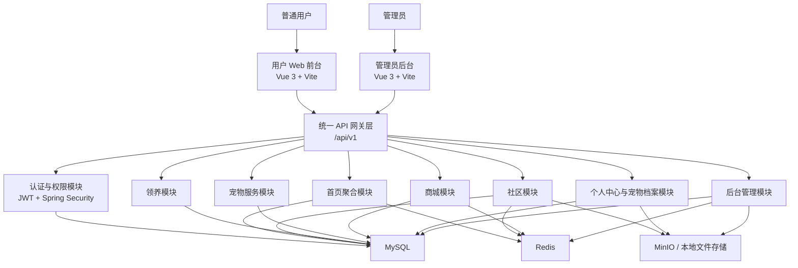
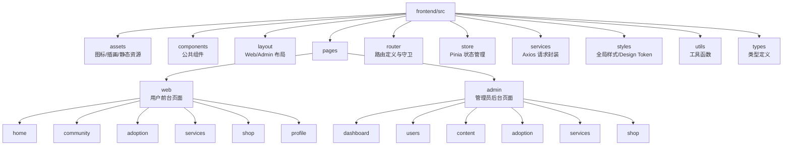
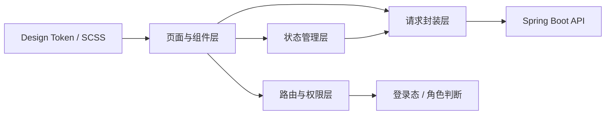
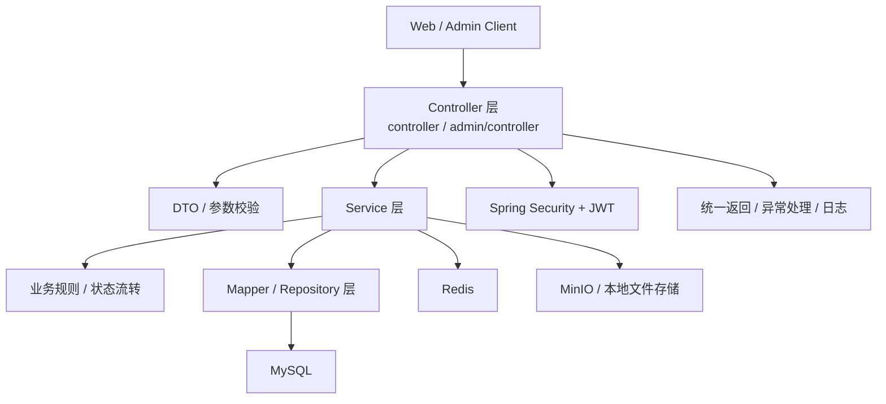
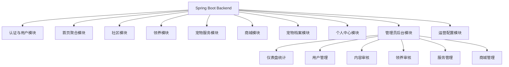
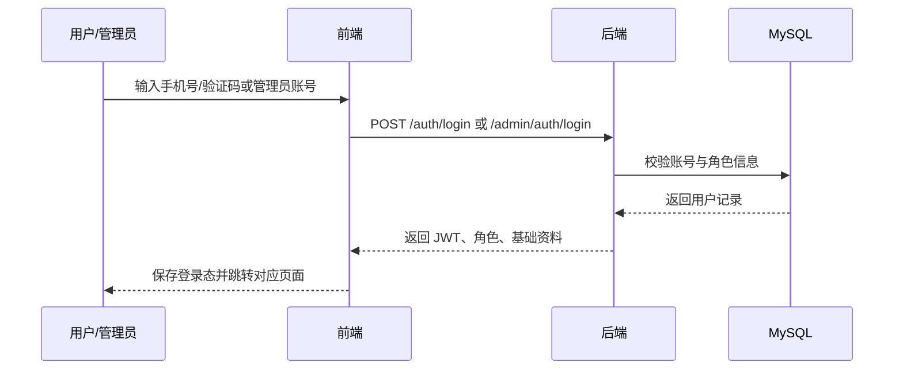
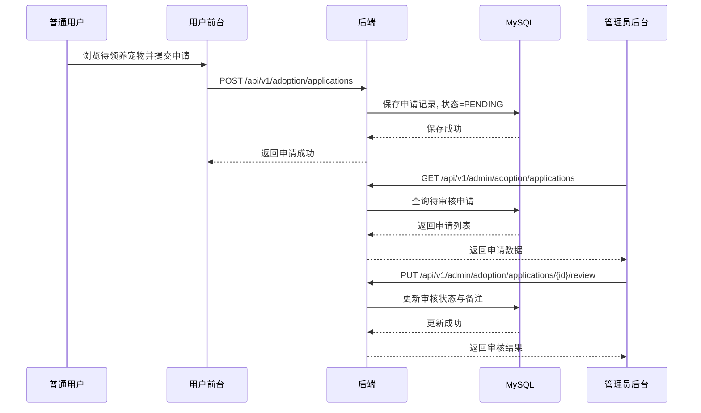
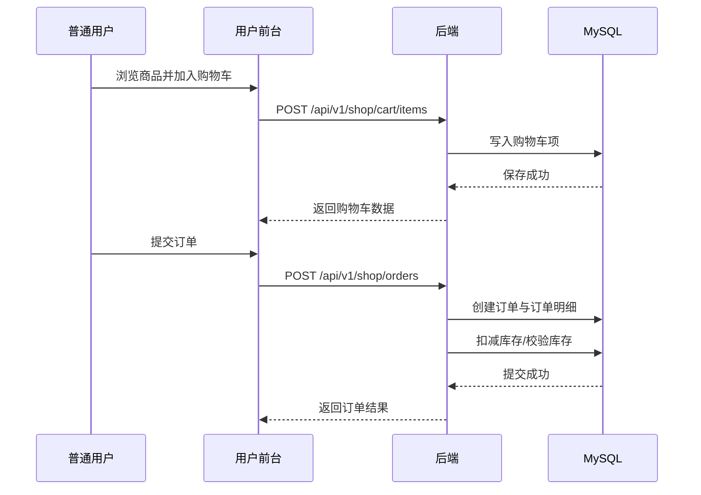
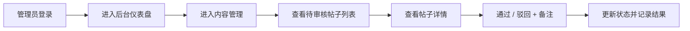

# 架构设计文档

## 1. 文档说明

本文档基于当前仓库中的需求、信息架构、前后端模块说明和 API 草案整理而成，用于统一描述宠物综合服务平台的整体架构设计。  

本文档重点覆盖：

- 系统总体架构
- 前端架构
- 后端架构
- 系统交互流程

数据库设计详见 [database.md](D:\Code\PetServicePlatform\docs\database.md)。

---

## 2. 系统目标与范围

平台面向养宠用户与平台运营人员，核心业务包括：

- 用户端：首页、社区、领养、宠物服务、商城、个人中心
- 管理端：仪表盘、用户管理、内容管理、领养管理、服务管理、商城管理
- 后端：统一鉴权、业务服务、数据存储、审核与运营配置

系统采用“三端协同”模式：

- 用户 Web 前台
- 管理员后台
- Spring Boot 后端服务

---

## 3. 总体架构

### 3.1 架构风格

项目采用典型的前后端分离架构：

- 前端使用 Vue 3 + Vite 构建用户端与管理端
- 后端使用 Spring Boot 3 提供 RESTful API
- 主数据存储使用 MySQL
- 缓存与会话辅助能力使用 Redis
- 图片与附件资源使用 MinIO 或本地静态资源目录

### 3.2 系统总体架构图

### 3.3 分层说明

- 表现层：用户前台与管理员后台，负责界面展示、路由切换、表单交互和状态呈现
- 接入层：统一 API 前缀与角色隔离策略，对外暴露用户端和管理端接口
- 业务层：按社区、领养、服务、商城、档案、后台运营等领域拆分模块
- 数据层：MySQL 持久化核心业务数据，Redis 缓存热点数据，文件存储承载图片附件

---

## 4. 前端架构

### 4.1 前端设计原则

- 用户端与管理端共用基础工程能力，减少重复开发
- 页面结构按业务域划分，方便路由和模块维护
- 公共组件、请求层、状态管理、设计 Token 统一沉淀
- 用户端强调体验与品牌风格，管理端强调效率与信息密度

### 4.2 前端目录与模块结构

### 4.3 前端逻辑分层

### 4.4 页面与组件结构

#### 用户端页面结构

- 首页：导航、搜索、Banner、快捷入口、推荐内容、推荐服务、推荐商品
- 社区：分类切换、帖子列表、帖子详情、评论区、发帖入口
- 领养：待领养列表、宠物详情、领养申请、流程说明
- 服务：服务分类、商家列表、商家详情、预约表单
- 商城：分类、商品列表、商品详情、购物车、订单流程
- 个人中心：个人信息、我的宠物、宠物档案、订单、收藏、消息中心

#### 管理端页面结构

- 仪表盘：核心统计、待处理事项、趋势图表
- 用户管理：搜索筛选、用户表格、详情抽屉、状态管理
- 内容管理：帖子审核、评论管理、标签管理、Banner、推荐位
- 领养管理：待领养宠物管理、申请审核、流程文案维护
- 服务管理：分类、商家、服务项目、预约单
- 商城管理：分类、商品、库存、订单、运营活动

### 4.5 关键前端公共能力

- 路由守卫：区分 `user` 与 `admin` 身份
- 请求拦截：统一注入 JWT，统一处理异常码
- 全局状态：登录态、购物车、消息、筛选条件
- 主题系统：颜色、圆角、阴影、状态色统一 Token 化
- 复用组件：卡片、按钮、标签、弹窗、表格、筛选栏、分页

---

## 5. 后端架构

### 5.1 后端设计原则

- 用户端与管理端共享一套服务体系，但接口按角色隔离
- 按业务域组织模块，避免 Controller 过度耦合
- 采用清晰的分层架构，便于后期扩展与测试
- 统一响应格式、统一鉴权方式、统一异常处理

### 5.2 后端分层架构图

### 5.3 后端业务模块划分

### 5.4 模块职责说明

#### 认证与用户模块

- 用户登录
- 管理员登录
- JWT 签发与校验
- 角色识别与权限控制
- 用户资料查询与更新

#### 首页聚合模块

- Banner 数据聚合
- 快捷入口配置
- 推荐帖子、服务、商品聚合
- 今日宠物小贴士与萌宠卡片

#### 社区模块

- 帖子发布、详情、列表
- 评论、点赞、收藏
- 标签分类
- 内容审核与推荐位联动

#### 领养模块

- 待领养宠物信息维护
- 领养申请提交
- 申请审核与状态流转
- 流程说明与展示

#### 宠物服务模块

- 服务分类
- 商家与服务项目管理
- 用户预约
- 预约单状态处理

#### 商城模块

- 商品分类与商品信息
- 购物车
- 订单创建与状态处理
- 后台商品上下架与库存管理

#### 宠物档案与个人中心模块

- 宠物信息
- 疫苗记录
- 体重记录
- 宠物相册
- 我的内容、我的订单、我的申请、消息中心

#### 管理员后台模块

- 仪表盘统计
- 用户管理
- 内容管理
- 领养审核
- 商家与服务管理
- 商品与订单管理

---

## 6. 系统交互流程

### 6.1 登录流程

### 6.2 领养申请与审核流程

### 6.3 商城下单流程

### 6.4 后台内容审核流程

---

## 7. 接口与权限设计

### 7.1 API 设计原则

- 用户端统一前缀：`/api/v1`
- 管理端统一前缀：`/api/v1/admin`
- 统一响应结构：`{ code, message, data }`
- 列表接口统一支持分页、筛选、排序

### 7.2 权限模型

当前设计采用轻量角色模型：

- `USER`：普通用户，访问前台业务接口
- `ADMIN`：管理员，访问后台管理接口

权限控制策略：

- 前端通过路由守卫控制页面访问
- 后端通过 Spring Security + JWT 控制接口访问
- 管理端接口全部要求 `ADMIN` 角色

---

## 8. 非功能性设计

### 8.1 可维护性

- 前端按页面域与公共能力分层
- 后端按业务模块分包
- 接口命名保持语义化和稳定性

### 8.2 可扩展性

- 用户端和管理端共享基础能力，便于扩展更多角色
- 业务模块解耦后可逐步增加消息、活动、日志等能力
- API 采用版本前缀，便于后续升级为 `/api/v2`

### 8.3 性能与稳定性

- 首页聚合、推荐位、热门列表可使用 Redis 缓存
- 图片文件与业务数据分离存储
- 列表查询默认分页，避免一次返回过多数据

### 8.4 安全性

- 所有登录态基于 JWT
- 管理端接口强制角色鉴权
- 表单输入需要参数校验与统一异常处理
- 文件上传需要限制大小、类型与访问路径

---

## 9. 当前阶段结论

从现有设计来看，项目已经具备较完整的逻辑架构骨架：

- 前端：用户端与管理端共用一套 Vue 工程
- 后端：Spring Boot 提供统一 API 与鉴权能力
- 数据层：MySQL + Redis + 文件存储
- 流程层：覆盖登录、领养审核、内容审核、购物下单等核心链路

该架构适合作为课程项目或 MVP 原型的实施基础。  
若后续进入编码阶段，建议优先落地：

1. 登录与角色鉴权
2. 社区基础链路
3. 领养申请与审核链路
4. 宠物档案链路
5. 管理端核心审核页面
