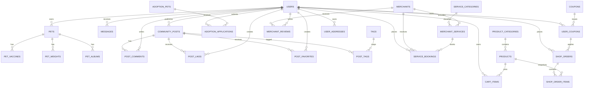

# 数据库设计文档

## 1. 文档说明

本文档描述宠物综合服务平台当前 MySQL 数据库设计，基于 `backend/src/main/resources/sql/schema.sql` 和 `seed.sql` 整理。数据库支撑用户前台、管理后台、联调演示数据和部署初始化。

SQL 初始化文件：

- `backend/src/main/resources/sql/schema.sql`
- `backend/src/main/resources/sql/seed.sql`

生产环境注意：

- `seed.sql` 仅适合本地演示和联调。
- 生产首次初始化后应将 `SPRING_SQL_INIT_MODE` 改为 `never`。
- `schema.sql` 包含少量兼容已有生产表的迁移语句，例如给 `shop_orders` 补 `discount_amount`、`user_coupon_id`。

## 2. 存储方案

| 类型 | 用途 |
|---|---|
| MySQL | 用户、社区、领养、服务、商城、消息、宠物档案、运营配置等核心业务数据 |
| 本地静态资源目录 | 图片上传、帖子图片、宠物图片、商品图片、Banner 图片 |
| Redis | 当前不是必需依赖，验证码和缓存能力保留扩展空间 |
| MinIO / 对象存储 | 当前不是必需依赖，文件存储保留扩展空间 |

## 3. 设计原则

- 按业务模块拆表，保持用户端和管理端共用同一业务数据源。
- 主键统一使用 `id`。
- 业务状态统一使用明确枚举字符串，如 `PENDING`、`APPROVED`、`REJECTED`、`CANCELLED`。
- 需要跨端查询的表建立 `user_id`、`status`、`created_at` 等索引。
- 订单、购物车、点赞、收藏等需要去重的关系使用唯一索引或业务校验。
- 历史订单明细保留商品快照，避免商品后续修改影响历史记录。

## 4. 核心表总览

| 模块 | 表 |
|---|---|
| 用户与消息 | `users`、`messages` |
| 宠物档案 | `pets`、`pet_vaccines`、`pet_weights`、`pet_albums` |
| 社区 | `community_posts`、`post_comments`、`post_likes`、`post_favorites`、`tags`、`post_tags` |
| 领养 | `adoption_pets`、`adoption_applications` |
| 服务 | `service_categories`、`merchants`、`merchant_services`、`merchant_reviews`、`service_bookings` |
| 商城 | `product_categories`、`products`、`cart_items`、`shop_orders`、`shop_order_items` |
| 地址与优惠券 | `user_addresses`、`coupons`、`user_coupons` |
| 运营配置 | `banners`、`recommendations` |

客服咨询复用 `messages` 表，通过消息类型、标题、内容、状态和回复内容承载在线客服与领养咨询。

后台监控指标当前为内存采集，不落库；接口见 `docs/monitoring.md`。

## 5. ER 图

## 6. 用户与消息

### 6.1 `users`

| 字段 | 类型 | 说明 |
|---|---|---|
| `id` | bigint | 主键 |
| `role` | varchar | `USER` / `ADMIN` |
| `phone` | varchar | 登录手机号，唯一 |
| `password_hash` | varchar | BCrypt 密码哈希 |
| `nickname` | varchar | 昵称 |
| `avatar_url` | varchar | 头像 |
| `gender` | varchar | 性别 |
| `bio` | varchar | 个人简介 |
| `status` | varchar | `ACTIVE` / `DISABLED` |
| `created_at` | datetime | 创建时间 |
| `updated_at` | datetime | 更新时间 |

### 6.2 `messages`

| 字段 | 类型 | 说明 |
|---|---|---|
| `id` | bigint | 主键 |
| `user_id` | bigint | 接收用户 |
| `type` | varchar | 系统、互动、客服等消息类型 |
| `title` | varchar | 标题 |
| `content` | text | 内容 |
| `is_read` | tinyint | 是否已读 |
| `status` | varchar | 客服处理状态等扩展状态 |
| `reply_content` | text | 管理员回复内容 |
| `created_at` | datetime | 创建时间 |
| `updated_at` | datetime | 更新时间 |

## 7. 宠物档案

### 7.1 `pets`

| 字段 | 类型 | 说明 |
|---|---|---|
| `id` | bigint | 主键 |
| `user_id` | bigint | 所属用户 |
| `name` | varchar | 宠物名称 |
| `type` | varchar | 猫、狗、其他 |
| `breed` | varchar | 品种 |
| `gender` | varchar | 性别 |
| `birthday` | date | 生日 |
| `weight` | decimal | 当前体重 |
| `avatar_url` | varchar | 头像 |
| `description` | varchar | 简介 |
| `created_at` / `updated_at` | datetime | 创建/更新时间 |

### 7.2 `pet_vaccines`、`pet_weights`、`pet_albums`

| 表 | 说明 |
|---|---|
| `pet_vaccines` | 疫苗名称、接种日期、下次接种日期、备注 |
| `pet_weights` | 体重、记录时间 |
| `pet_albums` | 图片 URL、图片说明 |

这些表均通过 `pet_id` 关联 `pets`，用于个人中心成长时间轴。

## 8. 社区

| 表 | 说明 |
|---|---|
| `community_posts` | 帖子标题、正文、封面、分类、审核状态、互动计数 |
| `post_comments` | 帖子评论 |
| `post_likes` | 点赞关系 |
| `post_favorites` | 收藏关系 |
| `tags` | 热门话题和内容标签 |
| `post_tags` | 帖子与标签多对多关系 |

关键约束：

- 点赞和收藏按 `post_id + user_id` 去重。
- 公开列表只展示审核通过的帖子。
- 管理端审核通过后，前台社区和用户主页同步可见。

## 9. 领养

### 9.1 `adoption_pets`

| 字段 | 说明 |
|---|---|
| `name`、`type`、`breed`、`gender`、`age_desc` | 宠物基础信息 |
| `city` | 所在城市 |
| `health_status` | 健康情况 |
| `personality` | 性格说明 |
| `adoption_requirements` | 领养要求 |
| `story` | 宠物故事 |
| `status` | `ONLINE` / `OFFLINE` / `ADOPTED` |
| `cover_url` | 展示图 |

### 9.2 `adoption_applications`

| 字段 | 说明 |
|---|---|
| `pet_id` | 申请宠物 |
| `user_id` | 申请用户 |
| `experience_desc` | 养宠经验 |
| `living_condition_desc` | 居住条件 |
| `contact_phone` | 联系电话 |
| `status` | `PENDING` / `APPROVED` / `REJECTED` |
| `review_remark` | 审核备注 |
| `reviewed_by` / `reviewed_at` | 审核人和审核时间 |

## 10. 服务预约

| 表 | 说明 |
|---|---|
| `service_categories` | 服务分类，如医院、美容、寄养、训练 |
| `merchants` | 商家基础信息、地址、电话、营业时间、评分、状态、图片 |
| `merchant_services` | 商家服务项目、价格、时长、状态 |
| `merchant_reviews` | 用户对商家的评价 |
| `service_bookings` | 预约单、预约时间、联系人、电话、状态、备注 |

预约状态：

- `PENDING`
- `CONFIRMED`
- `COMPLETED`
- `CANCELLED`

## 11. 商城

### 11.1 商品与购物车

| 表 | 说明 |
|---|---|
| `product_categories` | 商品分类和适用宠物类型 |
| `products` | 商品名称、副标题、主图、价格、库存、状态、描述 |
| `cart_items` | 用户购物车条目、数量、选中状态 |

商品状态：

- `ON_SALE`
- `OFF_SHELF`

### 11.2 地址与优惠券

#### `user_addresses`

| 字段 | 说明 |
|---|---|
| `user_id` | 所属用户 |
| `receiver_name` | 收货人 |
| `receiver_phone` | 收货电话 |
| `province` / `city` / `district` | 省市区 |
| `detail_address` | 详细地址 |
| `is_default` | 是否默认 |
| `status` | `ACTIVE` / `DISABLED` |

#### `coupons`

| 字段 | 说明 |
|---|---|
| `name` | 优惠券名称 |
| `type` | 优惠类型，当前为满减金额类 |
| `discount_amount` | 优惠金额 |
| `min_amount` | 使用门槛 |
| `start_at` / `end_at` | 有效期 |
| `status` | `ACTIVE` / `DISABLED` |

#### `user_coupons`

| 字段 | 说明 |
|---|---|
| `user_id` | 所属用户 |
| `coupon_id` | 优惠券 ID |
| `status` | `UNUSED` / `USED` / `EXPIRED` |
| `used_order_id` | 使用订单 |
| `used_at` | 使用时间 |

### 11.3 订单

#### `shop_orders`

| 字段 | 说明 |
|---|---|
| `user_id` | 下单用户 |
| `order_no` | 订单号，唯一 |
| `total_amount` | 商品总额 |
| `discount_amount` | 优惠金额 |
| `pay_amount` | 实付金额 |
| `user_coupon_id` | 使用的用户优惠券 |
| `status` | `PENDING` / `PAID` / `SHIPPED` / `COMPLETED` / `CANCELLED` |
| `receiver_name` / `receiver_phone` / `receiver_address` | 收货快照 |
| `remark` | 用户备注 |

#### `shop_order_items`

| 字段 | 说明 |
|---|---|
| `order_id` | 订单 ID |
| `product_id` | 商品 ID |
| `product_name` | 商品名称快照 |
| `product_image_url` | 商品图片快照 |
| `unit_price` | 下单单价 |
| `quantity` | 购买数量 |
| `subtotal_amount` | 小计 |

## 12. 运营配置

| 表 | 说明 |
|---|---|
| `banners` | 首页 Banner，包含标题、图片、链接、状态、排序 |
| `recommendations` | 推荐位，按 `slot_code + biz_type + biz_id` 指向帖子、服务、商品等业务对象 |
| `tags` | 标签管理，既用于社区话题，也可用于后台内容配置 |

## 13. 索引与约束重点

- `users.phone` 唯一。
- `shop_orders.order_no` 唯一。
- `cart_items` 按 `user_id + product_id` 去重。
- `post_likes`、`post_favorites` 按 `post_id + user_id` 去重。
- 列表高频查询字段建立组合索引，例如 `user_id + status + created_at`。
- `shop_orders.user_coupon_id` 建立索引，便于订单与优惠券追踪。

## 14. 初始化数据

`seed.sql` 提供演示账号、宠物、帖子、商品、商家、服务、订单、优惠券、消息等数据。演示账号见 `docs/integration.md`。

图片资源使用 `backend/src/main/resources/static/` 下的静态资源路径，避免正式页面继续展示纯占位图。

## 15. 维护要求

1. 新增或修改表结构后同步更新 `schema.sql`、实体、Mapper、DTO、`docs/database.md`。
2. 新增接口字段后同步更新 `docs/api.md` 和 `docs/api.yaml`。
3. 对已有生产表增加列时，需要在 `schema.sql` 中提供幂等迁移逻辑。
4. 修改种子数据时必须保持 UTF-8 无 BOM，避免 MySQL 解析失败或中文乱码。
