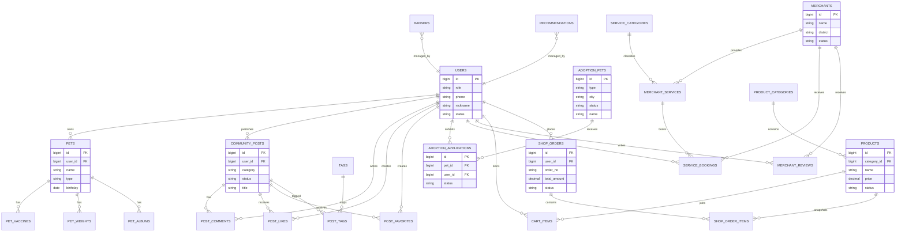

# 数据库设计文档

## 1. 文档说明

本文档基于当前项目的需求说明、信息架构、前后端模块说明与 API 草案整理而成，用于描述宠物综合服务平台的数据库设计方案。  

本文档重点包含：

- 数据存储方案
- 核心实体关系
- ER 图
- 核心表设计建议
- 索引与状态字段建议

---

## 2. 数据存储总体设计

系统采用“关系型数据库 + 缓存 + 文件存储”的组合方案：

- **MySQL**：存储用户、帖子、领养、预约、订单、宠物档案等核心业务数据
- **Redis**：缓存首页聚合数据、热门列表、验证码、登录会话辅助信息
- **MinIO / 本地静态资源目录**：存储图片、帖子附件、宠物相册、Banner 图等文件资源

说明：

- ER 图仅描述 MySQL 中的核心业务实体
- Redis 与文件存储不纳入 ER 图，但属于系统整体数据设计的一部分

---

## 3. 数据库设计原则

### 3.1 设计原则

- 以业务模块为边界组织表结构
- 先保证核心流程闭环，再考虑复杂扩展能力
- 主键统一，状态字段明确，审计字段完整
- 支持用户端和管理端共用同一套业务数据

### 3.2 建议命名规范

- 表名使用复数或复数语义的下划线命名，如 `users`、`community_posts`
- 主键统一为 `id`
- 外键字段统一使用 `{entity}_id`
- 时间字段统一为 `created_at`、`updated_at`
- 状态字段统一使用 `status`

### 3.3 建议公共字段

多数业务表建议包含以下公共字段：

- `id`：主键
- `created_at`：创建时间
- `updated_at`：更新时间

部分后台管理表建议增加：

- `created_by`：创建人
- `updated_by`：更新人
- `remark`：备注

---

## 4. 业务模块与核心表

| 模块 | 核心表 |
|---|---|
| 用户与权限 | `users`, `messages` |
| 宠物档案 | `pets`, `pet_vaccines`, `pet_weights`, `pet_albums` |
| 社区 | `community_posts`, `post_comments`, `post_likes`, `post_favorites`, `tags`, `post_tags` |
| 领养 | `adoption_pets`, `adoption_applications` |
| 宠物服务 | `service_categories`, `merchants`, `merchant_services`, `service_bookings`, `merchant_reviews` |
| 商城 | `product_categories`, `products`, `cart_items`, `shop_orders`, `shop_order_items` |
| 运营配置 | `banners`, `recommendations` |

---

## 5. ER 图

以下 ER 图为当前设计下的 **逻辑 ER 图**：

---

## 6. 核心表设计

以下表结构为建议方案，字段可以在开发阶段按实际实现做精简。

### 6.1 用户与消息模块

#### `users`

| 字段 | 类型 | 说明 |
|---|---|---|
| `id` | bigint | 主键 |
| `role` | varchar(20) | 角色，`USER` / `ADMIN` |
| `phone` | varchar(20) | 手机号，用户登录标识 |
| `nickname` | varchar(50) | 昵称 |
| `avatar_url` | varchar(255) | 头像 |
| `gender` | varchar(20) | 性别，可选 |
| `status` | varchar(20) | 账号状态，`ACTIVE` / `DISABLED` |
| `bio` | varchar(255) | 个人简介 |
| `created_at` | datetime | 创建时间 |
| `updated_at` | datetime | 更新时间 |

建议索引：

- 唯一索引：`phone`
- 普通索引：`role`, `status`, `created_at`

#### `messages`

| 字段 | 类型 | 说明 |
|---|---|---|
| `id` | bigint | 主键 |
| `user_id` | bigint | 接收用户 |
| `type` | varchar(30) | 消息类型，如系统消息、互动消息 |
| `title` | varchar(100) | 标题 |
| `content` | text | 内容 |
| `is_read` | tinyint | 是否已读 |
| `created_at` | datetime | 创建时间 |

建议索引：

- 组合索引：`user_id`, `is_read`, `created_at`

### 6.2 宠物档案模块

#### `pets`

| 字段 | 类型 | 说明 |
|---|---|---|
| `id` | bigint | 主键 |
| `user_id` | bigint | 所属用户 |
| `name` | varchar(50) | 宠物名 |
| `type` | varchar(20) | 猫/狗等 |
| `breed` | varchar(50) | 品种 |
| `gender` | varchar(20) | 性别 |
| `birthday` | date | 生日 |
| `weight` | decimal(8,2) | 当前体重，可做冗余 |
| `avatar_url` | varchar(255) | 头像 |
| `description` | varchar(255) | 简介 |
| `created_at` | datetime | 创建时间 |
| `updated_at` | datetime | 更新时间 |

建议索引：

- 组合索引：`user_id`, `type`

#### `pet_vaccines`

| 字段 | 类型 | 说明 |
|---|---|---|
| `id` | bigint | 主键 |
| `pet_id` | bigint | 宠物 ID |
| `vaccine_name` | varchar(100) | 疫苗名称 |
| `vaccinated_at` | date | 接种日期 |
| `next_due_at` | date | 下次接种日期 |
| `remark` | varchar(255) | 备注 |
| `created_at` | datetime | 创建时间 |

#### `pet_weights`

| 字段 | 类型 | 说明 |
|---|---|---|
| `id` | bigint | 主键 |
| `pet_id` | bigint | 宠物 ID |
| `weight` | decimal(8,2) | 体重 |
| `recorded_at` | datetime | 记录时间 |
| `created_at` | datetime | 创建时间 |

#### `pet_albums`

| 字段 | 类型 | 说明 |
|---|---|---|
| `id` | bigint | 主键 |
| `pet_id` | bigint | 宠物 ID |
| `image_url` | varchar(255) | 图片地址 |
| `caption` | varchar(255) | 图片说明 |
| `created_at` | datetime | 创建时间 |

### 6.3 社区模块

#### `community_posts`

| 字段 | 类型 | 说明 |
|---|---|---|
| `id` | bigint | 主键 |
| `user_id` | bigint | 发帖用户 |
| `category` | varchar(30) | 分类，如日常、求助、知识 |
| `title` | varchar(100) | 标题 |
| `content` | text | 正文 |
| `cover_url` | varchar(255) | 封面图 |
| `status` | varchar(20) | `PENDING` / `APPROVED` / `REJECTED` |
| `like_count` | int | 点赞数冗余 |
| `favorite_count` | int | 收藏数冗余 |
| `comment_count` | int | 评论数冗余 |
| `published_at` | datetime | 发布时间 |
| `created_at` | datetime | 创建时间 |
| `updated_at` | datetime | 更新时间 |

建议索引：

- 组合索引：`status`, `category`, `published_at`
- 普通索引：`user_id`

#### `post_comments`

| 字段 | 类型 | 说明 |
|---|---|---|
| `id` | bigint | 主键 |
| `post_id` | bigint | 帖子 ID |
| `user_id` | bigint | 评论用户 |
| `content` | text | 评论内容 |
| `status` | varchar(20) | 正常/删除/屏蔽 |
| `created_at` | datetime | 创建时间 |

#### `post_likes`

| 字段 | 类型 | 说明 |
|---|---|---|
| `id` | bigint | 主键 |
| `post_id` | bigint | 帖子 ID |
| `user_id` | bigint | 点赞用户 |
| `created_at` | datetime | 创建时间 |

建议约束：

- 唯一索引：`post_id`, `user_id`

#### `post_favorites`

| 字段 | 类型 | 说明 |
|---|---|---|
| `id` | bigint | 主键 |
| `post_id` | bigint | 帖子 ID |
| `user_id` | bigint | 收藏用户 |
| `created_at` | datetime | 创建时间 |

建议约束：

- 唯一索引：`post_id`, `user_id`

#### `tags` 与 `post_tags`

- `tags`：存储标签定义，如知识、晒宠、新手避坑
- `post_tags`：帖子与标签的多对多关联表

### 6.4 领养模块

#### `adoption_pets`

| 字段 | 类型 | 说明 |
|---|---|---|
| `id` | bigint | 主键 |
| `name` | varchar(50) | 宠物名 |
| `type` | varchar(20) | 猫/狗 |
| `breed` | varchar(50) | 品种 |
| `gender` | varchar(20) | 性别 |
| `age_desc` | varchar(50) | 年龄描述 |
| `city` | varchar(50) | 所在城市 |
| `health_status` | varchar(255) | 健康情况 |
| `personality` | varchar(255) | 性格说明 |
| `adoption_requirements` | text | 领养要求 |
| `story` | text | 宠物故事 |
| `status` | varchar(20) | `ONLINE` / `OFFLINE` / `ADOPTED` |
| `cover_url` | varchar(255) | 封面图 |
| `created_at` | datetime | 创建时间 |
| `updated_at` | datetime | 更新时间 |

建议索引：

- 组合索引：`status`, `type`, `city`

#### `adoption_applications`

| 字段 | 类型 | 说明 |
|---|---|---|
| `id` | bigint | 主键 |
| `pet_id` | bigint | 待领养宠物 ID |
| `user_id` | bigint | 申请用户 |
| `experience_desc` | text | 养宠经验 |
| `living_condition_desc` | text | 居住情况 |
| `contact_phone` | varchar(20) | 联系方式 |
| `status` | varchar(20) | `PENDING` / `APPROVED` / `REJECTED` |
| `review_remark` | varchar(255) | 审核备注 |
| `reviewed_by` | bigint | 审核管理员 |
| `reviewed_at` | datetime | 审核时间 |
| `created_at` | datetime | 创建时间 |

建议索引：

- 组合索引：`pet_id`, `status`
- 组合索引：`user_id`, `status`

### 6.5 宠物服务模块

#### `service_categories`

| 字段 | 类型 | 说明 |
|---|---|---|
| `id` | bigint | 主键 |
| `name` | varchar(50) | 分类名 |
| `sort` | int | 排序值 |
| `status` | varchar(20) | 启用状态 |

#### `merchants`

| 字段 | 类型 | 说明 |
|---|---|---|
| `id` | bigint | 主键 |
| `name` | varchar(100) | 商家名称 |
| `district` | varchar(50) | 区域 |
| `address` | varchar(255) | 地址 |
| `phone` | varchar(20) | 联系方式 |
| `business_hours` | varchar(100) | 营业时间 |
| `score` | decimal(3,1) | 评分冗余 |
| `status` | varchar(20) | 营业状态 |
| `created_at` | datetime | 创建时间 |
| `updated_at` | datetime | 更新时间 |

#### `merchant_services`

| 字段 | 类型 | 说明 |
|---|---|---|
| `id` | bigint | 主键 |
| `merchant_id` | bigint | 商家 ID |
| `category_id` | bigint | 服务分类 ID |
| `name` | varchar(100) | 服务项目名称 |
| `price` | decimal(10,2) | 价格 |
| `duration_minutes` | int | 时长 |
| `status` | varchar(20) | 启用状态 |
| `created_at` | datetime | 创建时间 |

#### `service_bookings`

| 字段 | 类型 | 说明 |
|---|---|---|
| `id` | bigint | 主键 |
| `user_id` | bigint | 预约用户 |
| `merchant_id` | bigint | 商家 ID |
| `merchant_service_id` | bigint | 服务项目 ID |
| `booking_time` | datetime | 预约时间 |
| `contact_name` | varchar(50) | 联系人 |
| `contact_phone` | varchar(20) | 联系电话 |
| `status` | varchar(20) | `PENDING` / `CONFIRMED` / `COMPLETED` / `CANCELLED` |
| `remark` | varchar(255) | 备注 |
| `created_at` | datetime | 创建时间 |
| `updated_at` | datetime | 更新时间 |

建议索引：

- 组合索引：`merchant_id`, `booking_time`, `status`
- 组合索引：`user_id`, `status`, `created_at`

#### `merchant_reviews`

- 记录用户对商家的评价
- 字段可包含：`merchant_id`, `user_id`, `score`, `content`, `created_at`

### 6.6 商城模块

#### `product_categories`

| 字段 | 类型 | 说明 |
|---|---|---|
| `id` | bigint | 主键 |
| `name` | varchar(50) | 分类名 |
| `pet_type` | varchar(20) | 适用宠物类型 |
| `sort` | int | 排序值 |
| `status` | varchar(20) | 启用状态 |

#### `products`

| 字段 | 类型 | 说明 |
|---|---|---|
| `id` | bigint | 主键 |
| `category_id` | bigint | 分类 ID |
| `name` | varchar(100) | 商品名称 |
| `subtitle` | varchar(255) | 副标题 |
| `image_url` | varchar(255) | 主图 |
| `price` | decimal(10,2) | 售价 |
| `stock` | int | 库存 |
| `pet_type` | varchar(20) | 适用宠物类型 |
| `status` | varchar(20) | `ON_SALE` / `OFF_SHELF` |
| `description` | text | 商品介绍 |
| `created_at` | datetime | 创建时间 |
| `updated_at` | datetime | 更新时间 |

建议索引：

- 组合索引：`category_id`, `status`, `price`
- 普通索引：`pet_type`

#### `cart_items`

| 字段 | 类型 | 说明 |
|---|---|---|
| `id` | bigint | 主键 |
| `user_id` | bigint | 用户 ID |
| `product_id` | bigint | 商品 ID |
| `quantity` | int | 数量 |
| `checked` | tinyint | 是否勾选 |
| `created_at` | datetime | 创建时间 |
| `updated_at` | datetime | 更新时间 |

建议约束：

- 唯一索引：`user_id`, `product_id`

#### `shop_orders`

| 字段 | 类型 | 说明 |
|---|---|---|
| `id` | bigint | 主键 |
| `user_id` | bigint | 下单用户 |
| `order_no` | varchar(64) | 订单号 |
| `total_amount` | decimal(10,2) | 订单总额 |
| `pay_amount` | decimal(10,2) | 实付金额 |
| `status` | varchar(20) | `PENDING` / `PAID` / `SHIPPED` / `COMPLETED` / `CANCELLED` |
| `receiver_name` | varchar(50) | 收货人 |
| `receiver_phone` | varchar(20) | 收货电话 |
| `receiver_address` | varchar(255) | 收货地址 |
| `remark` | varchar(255) | 用户备注 |
| `created_at` | datetime | 创建时间 |
| `updated_at` | datetime | 更新时间 |

建议索引：

- 唯一索引：`order_no`
- 组合索引：`user_id`, `status`, `created_at`

#### `shop_order_items`

| 字段 | 类型 | 说明 |
|---|---|---|
| `id` | bigint | 主键 |
| `order_id` | bigint | 订单 ID |
| `product_id` | bigint | 商品 ID |
| `product_name` | varchar(100) | 商品名快照 |
| `product_image_url` | varchar(255) | 商品图快照 |
| `unit_price` | decimal(10,2) | 下单单价 |
| `quantity` | int | 购买数量 |
| `subtotal_amount` | decimal(10,2) | 小计 |

### 6.7 运营配置模块

#### `banners`

| 字段 | 类型 | 说明 |
|---|---|---|
| `id` | bigint | 主键 |
| `title` | varchar(100) | Banner 标题 |
| `image_url` | varchar(255) | 图片地址 |
| `link_url` | varchar(255) | 跳转链接 |
| `status` | varchar(20) | 上下线状态 |
| `sort` | int | 排序 |
| `created_by` | bigint | 创建管理员 |
| `created_at` | datetime | 创建时间 |
| `updated_at` | datetime | 更新时间 |

#### `recommendations`

| 字段 | 类型 | 说明 |
|---|---|---|
| `id` | bigint | 主键 |
| `biz_type` | varchar(30) | 推荐对象类型，如 post/service/product |
| `biz_id` | bigint | 业务对象 ID |
| `slot_code` | varchar(30) | 推荐位编码 |
| `status` | varchar(20) | 启用状态 |
| `sort` | int | 排序 |
| `created_by` | bigint | 创建管理员 |
| `created_at` | datetime | 创建时间 |

---

## 7. 关键状态设计

### 7.1 用户状态

- `ACTIVE`：正常
- `DISABLED`：禁用

### 7.2 内容审核状态

- `PENDING`：待审核
- `APPROVED`：已通过
- `REJECTED`：已驳回

### 7.3 领养申请状态

- `PENDING`
- `APPROVED`
- `REJECTED`

### 7.4 服务预约状态

- `PENDING`
- `CONFIRMED`
- `COMPLETED`
- `CANCELLED`

### 7.5 商城订单状态

- `PENDING`
- `PAID`
- `SHIPPED`
- `COMPLETED`
- `CANCELLED`

---

## 8. 索引与约束建议

### 8.1 索引建议

- 高频列表字段建立组合索引，如 `status + created_at`
- 高并发去重关系建立唯一索引，如点赞、收藏、购物车
- 所有外键字段建立普通索引，如 `user_id`, `post_id`, `order_id`

### 8.2 约束建议

- 手机号、订单号等业务标识需要唯一约束
- 审核类表必须保留审核时间与审核备注
- 订单明细保留商品快照，避免商品后续修改影响历史订单
- 点赞、收藏、购物车项采用“用户 + 对象”唯一约束

---

## 9. 阶段性结论

基于当前设计，数据库方案已经能够支撑以下核心业务闭环：

- 用户登录与角色识别
- 社区内容发布、互动与审核
- 宠物档案维护
- 领养申请与审核
- 服务预约与处理
- 商城下单与订单管理
- Banner 与推荐位运营配置

对于课程项目实现，建议优先落地以下表：

1. `users`
2. `pets`
3. `community_posts`
4. `post_comments`
5. `adoption_pets`
6. `adoption_applications`
7. `products`
8. `shop_orders`
9. `shop_order_items`
10. `service_bookings`

如需进一步收敛 MVP，可先弱化 `messages`、`merchant_reviews`、`recommendations` 等扩展表。
