# 一、项目介绍 [负责人：qutianshun、chenhanyu]

## 1.1 背景与问题陈述 [负责人：qutianshun、chenhanyu]

随着城市养宠人群扩大，宠物已经从“陪伴对象”逐渐变成家庭生活的一部分。围绕宠物产生的需求不再局限于基础喂养，而是扩展到健康记录、服务预约、用品购买、领养救助、社区交流和智能问答等多个方向。实际使用中，这些能力往往分散在不同网站或应用中：领养信息发布渠道不统一，服务商家资料和预约流程分散，宠物用品购买与日常管理割裂，养宠知识和经验交流也缺乏统一沉淀。

本项目面向上述问题，设计并实现“宠物综合服务平台”。平台将社区、领养、服务、商城、宠物档案、消息通知、AI 宠医助手和管理后台整合到同一套前后端分离系统中，使普通用户可以完成“浏览内容、申请领养、预约服务、购买商品、管理宠物档案、接收通知”的完整闭环，也使管理员可以在后台完成审核、运营配置、订单与预约处理、客服回复和运行监控。

## 1.2 项目目标与核心功能 [负责人：qutianshun、chenhanyu]

项目目标是完成一个可运行、可联调、可部署、可测试的课程级 Web 应用，而不是只停留在静态页面或接口原型。当前已实现功能如下：

| 模块 | 已实现功能 | 主要负责人 |
|---|---|---|
| 首页 | Banner、推荐帖子、推荐服务、推荐商品、萌宠展示、全站搜索入口 | qutianshun、chenhanyu |
| 社区 | 帖子列表、分类/话题筛选、搜索、详情、发布、图片上传、点赞、收藏、评论 | qutianshun、chenhanyu |
| 领养 | 宠物筛选、详情弹窗、领养流程说明、领养要求弹窗、申请提交、申请记录、在线咨询 | qutianshun、chenhanyu |
| 服务 | 服务分类、商家列表、商家详情、服务项目、预约、我的预约、取消预约、后台预约处理 | qutianshun、chenhanyu |
| 商城 | 商品分类、搜索、详情、购物车、地址、优惠券、下单、支付、订单状态流转、后台订单处理 | qutianshun、chenhanyu |
| 个人中心 | 用户资料、宠物档案、成长时间轴、我的动态、我的收藏、订单、预约、消息中心 | qutianshun、chenhanyu |
| 管理后台 | 仪表盘、用户、内容、领养、服务、商城、客服消息、监控面板 | qutianshun、chenhanyu |
| AI 助手 | 侧边栏 AI 宠医助手、宠物档案上下文选择、快捷问题、护理计划等实用工具 | qutianshun、chenhanyu |

非功能目标包括：前后端接口统一、角色权限隔离、密码安全存储、SQL 注入防护、健康检查、监控指标、自动化测试、CI/CD、Docker 化部署和云平台部署。

## 1.3 技术选型 [负责人：qutianshun、chenhanyu]

| 层次 | 技术 | 版本/来源 | 选择理由 | 负责人 |
|---|---|---|---|---|
| 前端框架 | Vue 3 | `vue@3.5.13`，来源：https://vuejs.org/ | 组件化成熟，适合同时组织用户前台和管理后台 | qutianshun |
| 构建工具 | Vite | `vite@6.2.0`，来源：https://vite.dev/ | 开发启动快，构建配置轻量 | qutianshun |
| 类型系统 | TypeScript | `typescript@5.8.2`，来源：https://www.typescriptlang.org/ | 提高接口模型和组件参数的可维护性 | qutianshun |
| 状态管理 | Pinia | `pinia@2.3.1`，来源：https://pinia.vuejs.org/ | 管理登录态、购物车和跨页面状态 | qutianshun |
| HTTP 客户端 | Axios | `axios@1.9.0`，来源：https://axios-http.com/ | 拦截器适合统一 token、错误处理和日志 | qutianshun |
| 后端框架 | Spring Boot | `3.5.11`，来源：https://spring.io/projects/spring-boot | 适合 REST API、配置管理、测试和部署 | chenhanyu |
| 权限框架 | Spring Security | 随 Spring Boot 依赖，来源：https://spring.io/projects/spring-security | 实现 JWT 认证和角色隔离 | chenhanyu |
| ORM | MyBatis-Plus | `3.5.15`，来源：https://baomidou.com/ | 降低 CRUD 重复代码，保留 SQL 可控性 | chenhanyu |
| 数据库 | MySQL | 8.x，来源：https://www.mysql.com/ | 业务数据关系明确，适合订单、预约、申请等结构化模型 | chenhanyu |
| AI 模型接口 | DeepSeek / OpenAI 兼容接口 | 来源：https://platform.deepseek.com/ | 通过标准 Chat Completions 接入，便于替换模型 | chenhanyu |
| 部署 | Vercel、Railway、Docker | 来源：官方文档 | 分离部署前端、后端和数据库，适合课程演示 | qutianshun、chenhanyu |

## 1.4 团队分工 [负责人：qutianshun、chenhanyu]

| 成员 | 职责定位 | 主要工作 |
|---|---|---|
| qutianshun | 前端负责人 | UI/UX、Vue 前台、Vue 管理后台、前端 API 层、前端测试、Vercel 部署、部分 CI/CD 与 Docker 配置 |
| chenhanyu | 后端负责人 | Spring Boot API、数据库设计、权限认证、安全修复、业务服务、后端测试、Railway 部署、监控与健康检查 |

两人的阶段性工作记录放在 `docs/contributions/02-ui` 至 `docs/contributions/13-monitoring` 中，并按周次和姓名分别记录。

本章由 AI 辅助整理，经团队按代码和贡献文档审核修改。

# 二、版本控制与团队协作 [负责人：qutianshun、chenhanyu]

## 2.1 分支策略 [负责人：qutianshun、chenhanyu]

项目使用 GitHub 进行版本控制，采用接近 GitHub Flow 的协作方式。主分支用于保留稳定代码，功能开发在独立分支中完成，再通过 Pull Request 合并。前端和后端分别在各自功能分支中推进，降低互相覆盖的风险。

主要分支包括：

- `main`：稳定分支，用于最终提交、部署和 CI/CD。
- `develop` 或阶段开发分支：用于集成阶段性功能。
- `feature/*`：用于前端、后端、文档、测试、部署等任务开发。

该策略适合两人项目：每个成员可以围绕自己的模块独立提交，同时通过 PR 和 CI 检查发现冲突、测试失败和覆盖率问题。

## 2.2 提交规范 [负责人：qutianshun、chenhanyu]

项目提交信息遵循语义化约定，常见类型如下：

| 类型 | 用途 |
|---|---|
| `feat` | 新功能 |
| `fix` | 缺陷修复 |
| `docs` | 文档更新 |
| `test` | 测试相关 |
| `ci` | CI/CD 配置 |
| `security` | 安全修复 |
| `chore` | 构建、依赖、配置等杂项 |

Pull Request 的处理原则是：功能代码和文档同步提交；接口、数据库或部署配置变化必须更新对应文档；合并前应保证前后端测试和构建检查通过。

## 2.3 协作统计 [负责人：qutianshun、chenhanyu]

项目以 `docs/contributions` 中的周次贡献记录为主要协作证据。每一周按照课程任务分别记录前端和后端成员的工作，例如 UI/UX、架构、API、前端、后端、AI、测试、CI/CD、安全、Docker、云部署和监控。

协作过程中形成了三个重要机制：

1. 接口优先：后端实现接口后同步 `docs/api.md` 和 `docs/api.yaml`，前端按模块封装到 `frontend/src/api/modules`。
2. 联调记录：跨端问题集中沉淀到 `docs/integration.md`，避免只靠聊天记录定位问题。
3. 质量门禁：GitHub Actions 执行后端 Checkstyle/测试、前端 ESLint/覆盖率、密钥扫描和 Docker 构建。

本章由 AI 辅助整理，经团队按 Git 历史和贡献文档审核修改。

# 三、UI/UX 设计与原型 [负责人：qutianshun]

## 3.1 用户画像与场景分析 [负责人：qutianshun]

平台主要面向三类用户：

- 宠物主人：需要记录宠物信息、获取养宠知识、预约服务、购买用品和参与社区交流。
- 潜在领养用户：希望了解待领养宠物的健康、性格、城市、领养要求，并提交申请。
- 平台管理员：负责审核内容、处理领养申请、维护商家/商品/服务、回复客服消息和观察系统运行状态。

用户端设计侧重“温暖、可信、易浏览”。后台设计侧重“信息密度、筛选效率、状态清晰”。因此前台使用卡片、柔和色彩、宠物图片和轻量互动；后台使用表格、筛选器、状态标签和明确操作按钮。

## 3.2 界面原型设计 [负责人：qutianshun]

原型和页面截图存放在 `docs/design/` 和 `docs/design/screenshots/`。主要页面包括首页、社区、帖子详情、领养、服务、商城、购物车、结算、商品详情、个人中心和添加宠物档案。

设计重点如下：

| 模块 | 设计说明 |
|---|---|
| 首页 | 用聚合卡片降低入口寻找成本，将社区、领养、服务、商城和推荐资源放在首屏附近 |
| 社区 | 帖子卡片突出标题、图片、作者和互动数量，分类与话题筛选放在列表上方 |
| 领养 | 宠物卡片优先展示照片、城市、年龄和性格，详情中强调健康情况和领养要求 |
| 服务 | 先按服务类型筛选，再展示商家和服务项目，预约表单尽量减少重复输入 |
| 商城 | 商品卡片突出图片、价格和库存，结算页将地址、优惠券、商品明细和金额拆成清晰区域 |
| 个人中心 | 以“我的宠物”为核心，关联动态、收藏、订单、预约、消息和成长时间轴 |
| 管理后台 | 使用表格与筛选器处理高频运营任务，减少装饰元素 |

本报告不直接嵌入外部 Figma 链接。设计截图已导出到本地目录：

- `docs/design/home.png`
- `docs/design/community.png`
- `docs/design/adoption.png`
- `docs/design/services.png`
- `docs/design/store.png`
- `docs/design/profile.png`

## 3.2.1 交互设计原则 [负责人：qutianshun]

交互设计遵循以下原则：

1. 关键动作显性化：发布、预约、申请、下单、支付、审核、回复等动作均使用明确按钮。
2. 状态可见：帖子审核状态、订单状态、预约状态、领养申请状态均使用文案或标签提示。
3. 失败可理解：上传超限、接口失败、权限不足、表单未填等场景使用具体错误提示。
4. 数据闭环：前台提交的数据应能在“我的”页面或后台管理页面查看，后台处理结果应回到前台消息或状态。

## 3.2.2 用户体验设计 [负责人：qutianshun]

用户体验优化集中在三点：

- 减少重复输入：领养申请和预约表单默认使用当前账号手机号。
- 缩短查找路径：个人中心增加订单、预约、领养申请、消息通知等入口。
- 保持视觉一致：前台统一暖色和圆角卡片，后台统一表格、筛选和状态标签。

本章由 AI 辅助整理，经前端负责人按设计文件审核修改。

# 四、软件架构设计 [负责人：qutianshun、chenhanyu]

## 4.1 整体架构 [负责人：qutianshun、chenhanyu]

系统采用前后端分离架构。用户浏览器访问 Vue 前端，前端通过 `/api/v1` 调用用户端接口，通过 `/api/v1/admin` 调用管理端接口。后端以 Spring Boot 单体服务组织业务逻辑，使用 MyBatis-Plus 访问 MySQL。

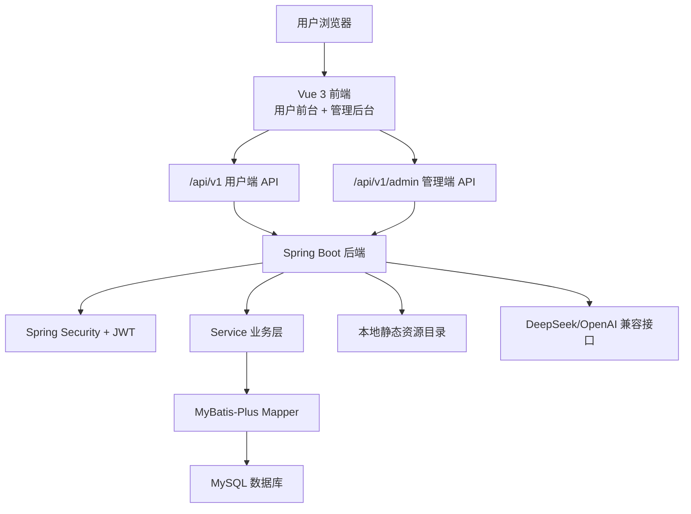

该设计的优点是边界清楚：前端专注页面和交互，后端专注业务规则和数据一致性。用户在 Vercel 或本地前端完成登录、发布帖子、提交预约、下单支付、客服咨询等操作时，页面不会直接修改本地模拟数据，而是通过 Axios API 层请求后端，等待 Service 层完成权限校验、状态流转和数据库写入后，再重新拉取真实状态。这样虽然增加了联调成本，但可以避免“页面看起来成功、数据库没有变化”的问题。

部署环境也沿用同一条链路：Vercel 托管 Vue 构建产物，Railway 运行 Spring Boot 容器和 MySQL 数据库。项目中遇到过 CORS 403、Railway 健康检查失败、生产库已有表结构未迁移、图片上传 413 等问题，最终都是沿着“浏览器请求 -> 前端 API 层 -> 后端安全过滤器 -> 业务服务 -> 数据库/文件/AI 服务”这条路径定位。因此 `docs/api.md`、`docs/api.yaml` 和 `docs/integration.md` 不只是补充材料，而是前后端协作时保持接口契约一致的主要依据。

## 4.2 技术架构分层 [负责人：qutianshun、chenhanyu]

### 4.2.1 表现层（前端）[负责人：qutianshun]

前端按页面、组件、API 模块和状态管理分层：

- `pages/web`：用户端页面。
- `pages/admin`：管理端页面。
- `components`：通用组件和 AI 助手组件。
- `api/http.ts`：Axios 实例、拦截器、响应解包。
- `api/modules`：业务接口封装。
- `store`：登录态、购物车、消息等状态。

### 4.2.2 业务逻辑层（后端）[负责人：chenhanyu]

后端采用 `controller -> service -> mapper -> database` 分层：

- Controller 接收请求、执行参数校验、返回统一响应。
- Service 处理权限归属、状态流转、库存、优惠券、审核、消息生成等业务规则。
- Mapper 通过 MyBatis-Plus 访问数据库。
- Security 层处理 JWT 解析、用户身份和角色鉴权。

### 4.2.3 数据访问层 [负责人：chenhanyu]

数据库使用 MySQL。核心数据按业务模块拆表，列表查询按 `user_id`、`status`、`created_at` 等字段建立索引。点赞、收藏、购物车等去重关系通过唯一索引或业务校验保护。订单明细保存商品快照，保证历史订单不受商品后续编辑影响。

## 4.3 关键设计决策 [负责人：qutianshun、chenhanyu]

| 决策 | 说明 |
|---|---|
| 使用 REST API | 项目主要是 CRUD 和状态流转，REST 更直观，便于 Swagger 和前端模块封装 |
| 用户端与管理端共用后端 | 避免重复业务逻辑，通过路径和角色权限隔离 |
| JWT 无状态认证 | 简化部署，不依赖服务端 Session |
| MySQL 而非非关系数据库 | 订单、预约、申请和用户关系结构明确，关系型建模更合适 |
| 本地文件存储作为 MVP | 降低部署复杂度，同时保留扩展到对象存储的配置边界 |

本章由 AI 辅助整理，经团队按 `docs/architecture.md`、`docs/frontend.md`、`docs/backend.md` 审核修改。

# 五、API 设计 [负责人：chenhanyu、qutianshun]

## 5.1 设计原则 [负责人：chenhanyu、qutianshun]

API 设计遵循以下原则：

- 统一版本前缀：用户端 `/api/v1`，管理端 `/api/v1/admin`。
- 统一响应结构：`{ code, message, data }`。
- 统一分页结构：`{ list, total, page, page_size }`。
- 写操作需要认证，管理端接口需要 `ADMIN` 角色。
- 状态字段使用明确枚举值，例如 `PENDING`、`PAID`、`SHIPPED`。
- 前端只通过 `frontend/src/api/modules/*.ts` 调用接口。

## 5.2 接口文档 [负责人：chenhanyu、qutianshun]

接口文档位于：

- `docs/api.md`
- `docs/api.yaml`
- 运行后 Swagger：`http://127.0.0.1:8080/swagger-ui.html`

核心接口分组如下：

| 分组 | 示例路径 | 说明 |
|---|---|---|
| 认证 | `/api/v1/auth/login` | 用户注册、登录、登出 |
| 首页与搜索 | `/api/v1/home`、`/api/v1/search` | 首页聚合和全站搜索 |
| 社区 | `/api/v1/community/posts` | 帖子、评论、点赞、收藏 |
| 领养 | `/api/v1/adoption/pets` | 宠物列表、申请、我的申请 |
| 服务 | `/api/v1/services/merchants` | 商家、服务、预约 |
| 商城 | `/api/v1/shop/products` | 商品、购物车、地址、优惠券、订单 |
| 个人中心 | `/api/v1/profile/overview` | 资料、概览 |
| 宠物档案 | `/api/v1/pets` | 宠物、疫苗、体重、相册、时间轴 |
| 消息 | `/api/v1/messages` | 消息中心、客服咨询 |
| 管理端 | `/api/v1/admin/**` | 后台管理、监控、客服处理 |

为了让接口文档更贴近实现，项目把接口按业务闭环而不是单个页面来验证。下面列出几个最核心的请求链路：

| 业务流程 | 主要请求链路 | 处理结果 |
|---|---|---|
| 注册与登录 | 前端提交手机号和密码 -> `/api/v1/auth/login` -> 后端校验 BCrypt 哈希并签发 JWT | 前端保存 token，后续请求自动带上 `Authorization` |
| 发布社区帖子 | 前端提交标题、内容和图片 -> 社区发布接口 -> 后端写入帖子和图片路径 | 发布成功后跳转帖子详情，个人中心动态同步更新 |
| 服务预约 | 前端选择商家、服务项目、预约时间和联系人 -> 预约接口 -> 后端校验用户、商家和时间信息 | 预约记录进入“我的预约”，后台可以查看并处理 |
| 商城下单支付 | 前端选择地址、商品、数量和优惠券 -> 创建订单 -> 支付接口更新状态 | 订单从 `PENDING` 流转到 `PAID`，后台订单管理可发货 |
| 客服回复 | 用户侧边栏提交咨询 -> 后台客服列表读取 -> 管理员回复 | 用户消息中心和在线客服会话可以看到回复内容 |

这些链路在联调时都以“前台提交、后台处理、前台重新读取”为验收标准。这样可以及时发现前端仍使用模拟数据、后端缺少接口、数据库字段未迁移等问题。

## 5.3 接口安全设计 [负责人：chenhanyu]

后端通过 Spring Security 和 JWT 实现接口保护。登录成功后返回 token，前端在请求拦截器中统一添加 `Authorization: Bearer <token>`。后端根据 token 解析用户 ID 和角色，普通用户只能访问自己的订单、预约、宠物档案等数据；后台接口要求 `ADMIN` 角色。

敏感配置不写入代码仓库，统一通过环境变量传入，例如 `JWT_SECRET`、`SPRING_DATASOURCE_PASSWORD`、`DEEPSEEK_API_KEY`。

## 5.4 接口测试 [负责人：chenhanyu、qutianshun]

后端使用 MockMvc 和 Service 测试覆盖主要接口、权限和业务规则；前端使用 Vitest 对 API 解包、状态管理、通用组件和 AI 助手进行测试。联调测试清单见 `docs/integration.md`。

本章由 AI 辅助整理，经团队按 `docs/api.md` 和代码审核修改。

# 六、前端实现 [负责人：qutianshun]

## 6.1 技术栈与开发环境 [负责人：qutianshun]

前端采用 Vue 3、Vite、TypeScript、Vue Router、Pinia、Axios 和 SCSS。开发命令如下：

```bash
cd frontend
npm install
npm run dev
```

构建和测试命令如下：

```bash
npm run build
npm run test
npm run test:coverage
```

## 6.2 核心功能模块实现 [负责人：qutianshun]

### 6.2.1 用户前台实现 [负责人：qutianshun]

用户前台按业务域拆分页面。首页用于聚合资源；社区支持分类、搜索、详情、发布和互动；领养支持弹窗详情、申请和咨询；服务支持商家和预约；商城支持购物车、地址、优惠券和订单；个人中心汇总用户自己的宠物、动态、收藏、订单、预约和消息。

前端实现难点在于跨页面数据同步。例如用户在商城提交订单后，订单页必须从后端重新加载真实订单，而不是继续使用本地模拟数据。项目通过统一 API 模块和页面加载函数保证提交后刷新数据。

### 6.2.2 管理后台实现 [负责人：qutianshun]

管理后台围绕运营任务设计，包括仪表盘、用户管理、内容管理、领养管理、服务管理、商城管理、客服消息和监控面板。页面风格更强调表格、筛选、状态和批处理入口。

后台中“待处理事项”的跳转、客服回复、预约处理、订单发货、领养审核等操作都需要与后端状态保持一致。前端在操作成功后刷新列表，并通过状态标签展示当前业务状态。

### 6.2.3 API 层实现 [负责人：qutianshun]

前端 API 层位于 `frontend/src/api`。其中 `http.ts` 创建 `webHttp` 和 `adminHttp` 两个 Axios 实例，分别对应用户端和管理端前缀。模块文件如 `shop.ts`、`services.ts`、`community.ts` 封装具体接口，使页面不直接感知后端 URL。

简化后的响应解包逻辑如下：

```ts
if (response.code !== 0) {
  throw new Error(response.message || "请求失败");
}
return response.data;
```

这种方式让页面只处理业务数据和错误提示，避免每个页面重复判断响应结构。

### 6.2.4 AI 与客服侧边栏 [负责人：qutianshun]

用户端布局集成了侧边停靠栏，包含在线客服和 AI 助手。AI 助手支持选择“我的宠物”中的具体宠物，将宠物名称、类型、品种、生日、体重等上下文追加到用户问题中，再调用后端 AI 接口。在线客服提交的咨询会进入后台客服消息，管理员回复后可在前台消息中心和客服会话中查看。

## 6.3 性能优化实践 [负责人：qutianshun]

已实现的前端优化包括：

- 使用 Vite 构建和按页面组织路由，减少开发和构建成本。
- 图片资源放入静态资源目录，避免使用外部不可控链接。
- API 请求统一封装，减少重复代码和错误处理分散。
- 通用组件抽象为 `DataState`、`StatusBadge` 等，降低页面重复渲染逻辑。

前端已补充 Lighthouse 截图作为性能证据。报告中不手工编造 LCP、INP、CLS 数值，具体数值以截图中的 Lighthouse 结果为准。

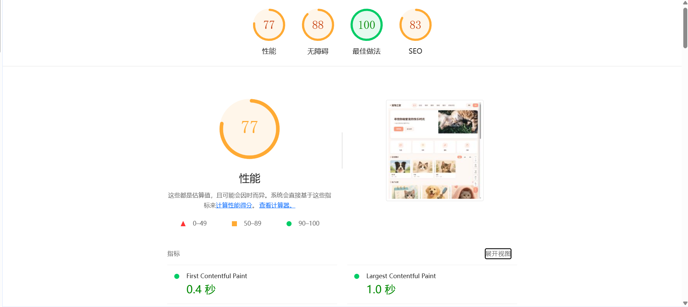

从截图可以看出，前端性能优化主要依赖 Vite 构建、静态资源本地化、页面组件复用和 API 统一封装。后续如果继续优化，应优先关注首屏图片体积、长列表分页加载和后台表格渲染成本。

## 6.4 兼容性处理 [负责人：qutianshun]

项目面向桌面浏览器和常见移动宽度进行了响应式处理。表单、卡片、列表和后台表格使用弹性布局和固定间距，避免文本与按钮重叠。对于文件上传，前端对图片大小和类型做初步限制，后端也配置 multipart 限制，防止超大文件导致请求失败。

本章由 AI 辅助整理，经前端负责人按当前代码审核修改。

# 七、后端实现 [负责人：chenhanyu]

## 7.1 技术栈与架构 [负责人：chenhanyu]

后端采用 Java 17、Spring Boot 3.5.11、Spring Security、JWT、MyBatis-Plus、MySQL 和 Springdoc OpenAPI。后端整体结构分为 Controller、Service、Mapper、Entity、DTO、Security、Config 和 Common。

选择 Spring Boot 的原因是其对 REST API、配置管理、安全、测试、Docker 部署的支持较完整，适合课程项目在有限时间内实现可靠后端。

## 7.2 核心业务模块实现 [负责人：chenhanyu]

### 7.2.1 用户认证与授权 [负责人：chenhanyu]

用户登录时后端校验手机号和 BCrypt 密码哈希，成功后生成 JWT。后续请求由认证过滤器解析 token，将用户身份放入安全上下文。管理端接口要求 `ADMIN` 角色，普通用户无法访问。

### 7.2.2 社区、领养、服务与商城 [负责人：chenhanyu]

社区模块处理帖子、评论、点赞、收藏和审核状态；领养模块处理待领养宠物和申请审核；服务模块处理商家、服务项目、预约和评价；商城模块处理商品、购物车、地址、优惠券、订单和库存。后端在 Service 层控制业务状态流转，例如订单只能在合法状态下支付、取消、发货或确认收货。

### 7.2.3 消息、客服与 AI [负责人：chenhanyu]

消息模块既支持普通通知，也支持在线客服咨询。用户提交咨询后，后台可以回复并标记已处理，回复内容会生成用户可见消息。AI 模块通过 OpenAI 兼容接口调用 DeepSeek，返回回答和补充建议。

### 7.2.4 健康检查与监控 [负责人：chenhanyu]

后端提供 `/health` 和 `/api/v1/health`。监控指标由内存中的 `MetricsCollector` 收集，包括总请求数、成功数、失败数、错误率、平均响应时间和路径统计。管理端通过 `/api/v1/admin/monitoring/metrics` 等接口读取这些指标。

## 7.3 数据库设计 [负责人：chenhanyu]

数据库设计详见 `docs/database.md`。核心表包括 `users`、`messages`、`pets`、`community_posts`、`adoption_pets`、`service_bookings`、`products`、`cart_items`、`shop_orders`、`shop_order_items`、`user_addresses`、`coupons` 和 `user_coupons`。

数据库设计重点：

- 用 `user_id` 保证用户数据归属。
- 用状态字段表示审核、预约、订单和申请流转。
- 用订单明细快照保存历史商品信息。
- 用幂等 `ALTER TABLE` 处理生产库已有表缺失字段的问题。

核心表之间的关系如下：

| 业务对象 | 主要关系 | 设计说明 |
|---|---|---|
| 用户与宠物档案 | `users` 1:N `pets` | 宠物档案属于具体用户，疫苗、体重、成长时间轴等内容围绕宠物展开 |
| 用户与社区内容 | `users` 1:N `community_posts`，帖子再关联评论、点赞和收藏 | 社区互动需要同时记录作者、互动用户和内容状态，方便个人主页统计动态、获赞和收藏 |
| 用户与领养申请 | `users` 1:N `adoption_applications`，申请关联 `adoption_pets` | 用户提交申请后由后台审核，宠物自身状态和申请状态需要分别保存 |
| 用户与服务预约 | `users` 1:N `service_bookings`，预约关联商家和服务项目 | 前台提交预约后，个人中心和后台服务管理都读取同一条预约记录 |
| 用户与商城订单 | `users` 1:N `shop_orders`，订单 1:N `shop_order_items` | 订单主表保存收货、金额、优惠券和状态，明细表保存商品快照，避免商品改名或改价影响历史订单 |
| 用户与消息客服 | `users` 1:N `messages` | 系统通知、客服咨询和后台回复统一进入消息表，前台消息中心和在线客服会话共用数据来源 |

这套设计的取舍是：核心业务都保留明确的关系和状态字段，不把订单、预约、申请等信息塞进 JSON 字段。这样做表数量更多，但后台审核、用户查询、统计监控和后续迁移都更清楚。

## 7.4 中间件与工具集成 [负责人：chenhanyu]

后端集成了：

- Spring Security：认证和权限控制。
- JWT：无状态登录。
- MyBatis-Plus：参数化查询和分页。
- Springdoc OpenAPI：生成 Swagger 文档。
- Logback + Logstash Logback Encoder：结构化日志。
- JaCoCo：测试覆盖率报告。

Redis 和 MinIO 目前未作为运行必需服务接入，文档中只作为后续扩展方向保留。

## 7.5 性能优化实践 [负责人：chenhanyu]

后端已做的性能与稳定性处理包括：

- 高频列表按 `status`、`user_id`、`created_at` 建立索引。
- 查询关联数据时尽量批量加载，减少循环查询。
- 点赞、收藏、购物车等关系通过唯一约束或业务校验避免重复数据。
- 统一分页，避免一次性返回过大列表。

后端已补充接口性能测试截图。报告不单独摘抄未经复核的 P99、吞吐量等数值，具体结果以截图记录为准。

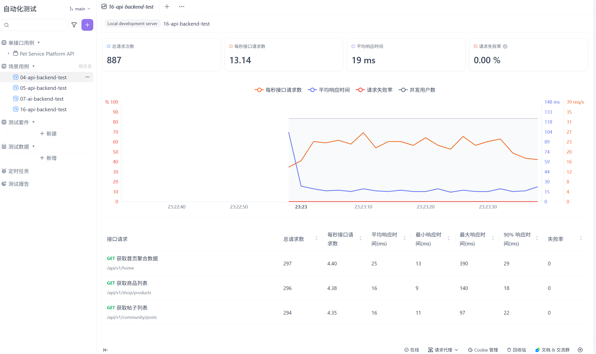

从后端实现角度看，性能瓶颈主要可能出现在列表聚合、订单明细加载、后台统计和图片上传等场景。因此当前实现重点放在分页查询、索引设计、批量加载关联数据和请求指标采集上，而不是过早引入缓存或消息队列。

本章由 AI 辅助整理，经后端负责人按当前代码审核修改。

# 八、AI 工程化应用 [负责人：qutianshun、chenhanyu]

## 8.1 AI 辅助开发实践 [负责人：qutianshun、chenhanyu]

团队在开发中使用 AI 工具辅助生成初稿、排查错误、整理文档和补充测试，但最终代码和文档由成员人工审核。AI 主要用于：

- 生成前端页面和组件的初版结构。
- 根据报错日志分析部署失败原因。
- 根据接口和数据库变化提醒文档同步项。
- 辅助生成测试用例和覆盖率缺口分析。
- 辅助整理最终开发文档。

## 8.2 AI 辅助故障排查 [负责人：qutianshun、chenhanyu]

项目部署和联调中曾遇到多类问题，例如 Railway 健康检查失败、SQL 初始化中文乱码、`seed.sql` BOM、生产表缺失列、Vercel 旧部署地址失效、CORS 403、图片上传 413 等。团队将错误日志、环境变量、SQL 语句和截图作为上下文提供给 AI，再由成员检查建议是否与代码一致。

一个典型案例是 `shop_orders` 表缺少 `discount_amount` 和 `user_coupon_id`。AI 提醒 `CREATE TABLE IF NOT EXISTS` 不会修改已存在表，团队据此在 `schema.sql` 中补充幂等迁移逻辑，避免生产库启动时因种子数据插入失败导致健康检查失败。

## 8.3 AI 功能集成 [负责人：qutianshun、chenhanyu]

项目集成了 AI 宠医助手。前端组件位于 `frontend/src/components/ai/AIPetDoctorChat.vue`，后端接口为 `POST /api/v1/ai/chat`。用户可以选择自己的宠物档案作为上下文，系统将宠物资料和用户问题一起发送给后端，由后端调用 DeepSeek/OpenAI 兼容接口生成回答。

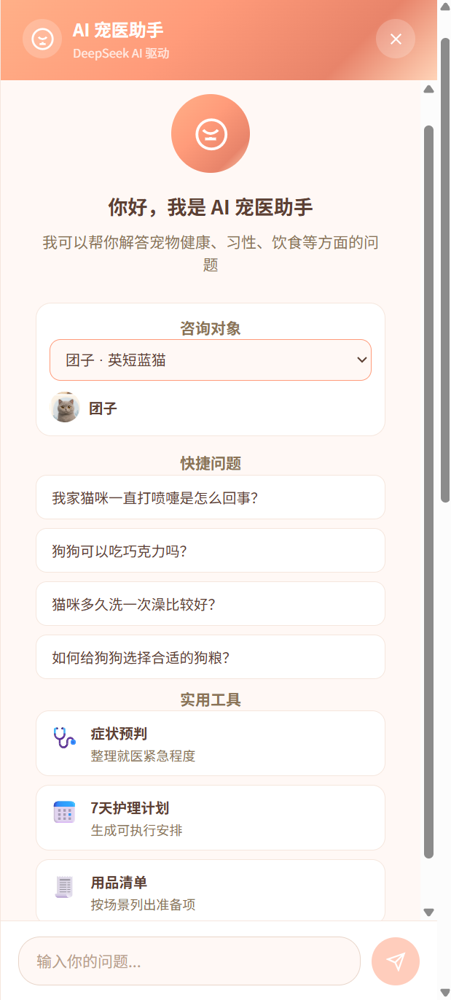

该功能的重点不是做一个普通聊天框，而是围绕养宠场景做了三层产品化设计：

| 创新点 | 实现方式 | 用户价值 |
|---|---|---|
| 宠物档案上下文 | 前端允许用户选择“我的宠物”中的具体宠物，将名称、类型、品种等信息作为问题上下文 | 同样是“猫咪不舒服”，系统能结合当前宠物给出更贴近场景的建议 |
| 快捷问题入口 | 预置常见问题，例如猫咪叫声、狗狗饮食、洗澡频率和狗粮选择 | 降低用户提问门槛，让 AI 功能更容易被普通养宠用户使用 |
| 实用工具扩展 | 提供症状预判、7 天护理计划、用品清单等入口 | 从单次问答扩展到护理安排和准备清单，更接近日常养宠流程 |

后端在调用模型前会拼接系统提示词，要求模型以养宠建议和信息辅助为边界；当用户描述严重症状时，应提示及时就医，而不是替代专业诊断。这样的设计既保留了 AI 功能的实用性，也控制了宠物医疗场景中的误导风险。

本章由 AI 辅助整理，经团队按 `docs/ai-feature.md` 和代码审核修改。

# 九、安全设计 [负责人：chenhanyu、qutianshun]

## 9.1 安全威胁分析 [负责人：chenhanyu、qutianshun]

系统主要面临以下风险：

- 未授权访问：普通用户访问后台接口或查看他人数据。
- SQL 注入：筛选、搜索、分类等输入进入查询条件。
- 密钥泄露：JWT 密钥、数据库密码、AI API Key 被提交到仓库。
- 跨域配置错误：生产前端域名未被后端允许导致 403，或允许范围过宽。
- 文件上传风险：上传超大文件或非图片文件。
- XSS 风险：社区内容和评论由用户输入，需要前端正确渲染。

## 9.2 安全防护措施 [负责人：chenhanyu、qutianshun]

### 9.2.1 身份认证与授权 [负责人：chenhanyu]

后端使用 JWT 与 Spring Security。后台接口需要 `ADMIN` 角色，用户端写操作需要登录。Service 层还会检查资源归属，例如订单、预约、宠物档案只能由所属用户访问。

### 9.2.2 输入验证与 SQL 注入防护 [负责人：chenhanyu]

后端使用 Bean Validation 和 MyBatis-Plus 参数化查询。已修复历史上使用字符串拼接风险较高的查询方式，改为先查询 ID 列表再使用参数化 `in` 条件。

### 9.2.3 敏感数据保护 [负责人：chenhanyu]

密码使用 BCrypt 哈希存储。`JWT_SECRET`、数据库密码和 AI Key 通过环境变量配置，不写入代码。`.env.example` 只提供变量名和示例格式。

### 9.2.4 其他安全措施 [负责人：qutianshun、chenhanyu]

- 前端不使用 `v-html` 渲染用户内容。
- 上传文件限制类型和大小。
- 生产 CORS 使用 `APP_CORS_ALLOWED_ORIGIN_PATTERNS` 配置当前 Vercel 域名。
- CI 中使用 Gitleaks 检查密钥泄露。

## 9.3 安全审计 [负责人：chenhanyu、qutianshun]

安全审查记录见 `docs/security-review.md`。CI 配置包括：

- `.github/workflows/security.yml`：Gitleaks 密钥扫描。
- `.github/workflows/codeql.yml`：CodeQL 安全分析。
- `.github/workflows/docker.yml`：Docker 镜像构建和 Trivy 漏洞扫描。

本章由 AI 辅助整理，经团队按安全审查文档审核修改。

# 十、软件测试 [负责人：qutianshun、chenhanyu]

## 10.1 测试策略 [负责人：qutianshun、chenhanyu]

测试采用前后端分层策略：

- 后端：Controller 权限测试、Service 业务规则测试、H2 集成测试。
- 前端：API 解包、状态管理、通用组件、AI 助手组件、基础 smoke 测试。
- 联调：按 `docs/integration.md` 手工验证跨端业务闭环。
- CI：Pull Request 自动运行测试和覆盖率上传。

## 10.2 单元测试 [负责人：qutianshun、chenhanyu]

后端测试文件位于 `backend/src/test`，当前本地统计为 32 个 Java 测试文件。前端测试文件位于 `frontend/src/__tests__`，包含 8 个测试文件。

当前本地覆盖率结果：

| 端 | 指标 | 覆盖率 |
|---|---|---|
| 后端 | JaCoCo Line Coverage | 76.84% |
| 后端 | JaCoCo Instruction Coverage | 75.46% |
| 前端 | Vitest Line Coverage | 85.02% |
| 前端 | Vitest Statement Coverage | 84.37% |
| 前端 | Vitest Branch Coverage | 58.62% |

覆盖率来自本地 `backend/target/site/jacoco/jacoco.xml` 和 `frontend/coverage/coverage-summary.json`。

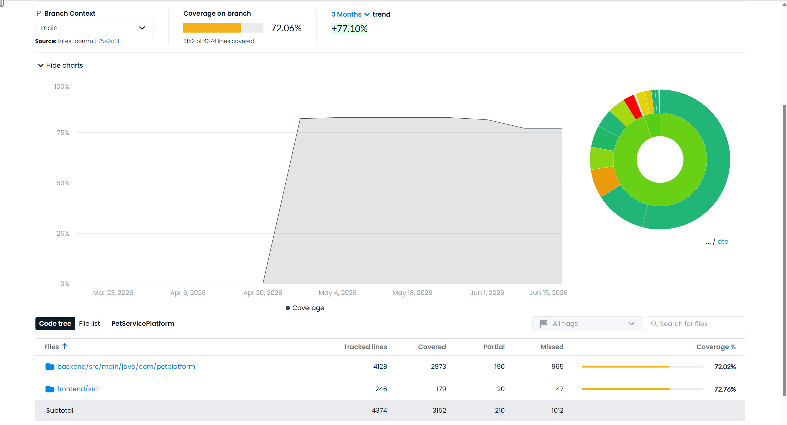

## 10.3 集成测试 [负责人：chenhanyu、qutianshun]

后端使用 H2 和 MockMvc 测试核心接口链路，验证认证、授权、分页、状态流转和错误处理。前后端联调以真实后端 API 为准，重点验证“前台提交、后台处理、前台状态更新”的闭环。

## 10.4 端到端测试 [负责人：qutianshun]

项目当前未建立完整 Playwright 端到端自动化套件。联调和验收主要通过 `docs/integration.md` 的手工清单完成。若后续补充 E2E，建议优先覆盖登录、发布帖子、提交预约、下单支付、后台审核和客服回复。

## 10.5 测试结果汇总 [负责人：qutianshun、chenhanyu]

| 测试类型 | 工具 | 当前状态 |
|---|---|---|
| 后端单元/集成测试 | JUnit 5、MockMvc、H2 | 已配置并接入 CI |
| 前端单元/组件测试 | Vitest、Vue Testing Library | 已配置并接入 CI |
| 覆盖率 | JaCoCo、Vitest Coverage、Codecov | 已配置 |
| 安全扫描 | Gitleaks、CodeQL、Trivy | 已配置 |
| E2E 自动化 | Playwright | 未作为最终交付实现，后续可扩展 |

除自动化测试外，项目后期做了多轮手工联调。联调中发现的问题大多不是单个页面样式问题，而是“前端页面、后端接口、数据库状态”三者没有完全闭环。典型修复如下：

| 问题 | 现象 | 修复方式 | 负责人 |
|---|---|---|---|
| 生产跨域 403 | Vercel 前端登录或注册被后端拒绝 | 后端 CORS 支持通过环境变量配置当前 Vercel 域名 | chenhanyu |
| SQL 初始化失败 | Railway 健康检查不通过，`seed.sql` 执行失败 | 修复 UTF-8 编码和 BOM，补充幂等表结构迁移 | chenhanyu |
| 图片上传 413 | 社区发布帖子上传大图失败 | 前端限制上传体积，后端调整 multipart 限制和错误提示 | qutianshun、chenhanyu |
| 订单状态不同步 | 支付后订单页仍显示待支付或操作失败 | 前端支付后重新拉取订单，后端补齐订单状态流转校验 | qutianshun、chenhanyu |
| 消息中心 500 | `/api/v1/messages` 返回服务器异常 | 修复消息查询和客服回复数据结构，前台消息中心读取真实数据 | chenhanyu、qutianshun |

这些问题的修复让最终系统从“页面可展示”推进到“业务可闭环”。报告中只保留已修复并能在当前代码中验证的内容，未完成的 E2E 自动化和正式告警平台放到总结展望中说明。

本章由 AI 辅助整理，经团队按测试报告文件审核修改。

# 十一、持续集成与持续交付（CI/CD）[负责人：qutianshun、chenhanyu]

## 11.1 CI/CD 方案 [负责人：qutianshun、chenhanyu]

项目使用 GitHub Actions。CI 主要覆盖后端构建测试、前端 lint 和测试、覆盖率上传、安全扫描、Docker 镜像构建。

## 11.2 自动化流水线 [负责人：qutianshun、chenhanyu]

主要工作流：

| 文件 | 内容 |
|---|---|
| `.github/workflows/ci.yml` | 后端 Checkstyle + 测试，前端 ESLint + 覆盖率测试，上传 Codecov |
| `.github/workflows/backend-test.yml` | 后端测试专用流程 |
| `.github/workflows/frontend-test.yml` | 前端测试专用流程 |
| `.github/workflows/security.yml` | Gitleaks 密钥扫描 |
| `.github/workflows/codeql.yml` | CodeQL 安全分析 |
| `.github/workflows/docker.yml` | 构建前后端 Docker 镜像并执行 Trivy 扫描 |

CI/CD 执行结果截图如下：

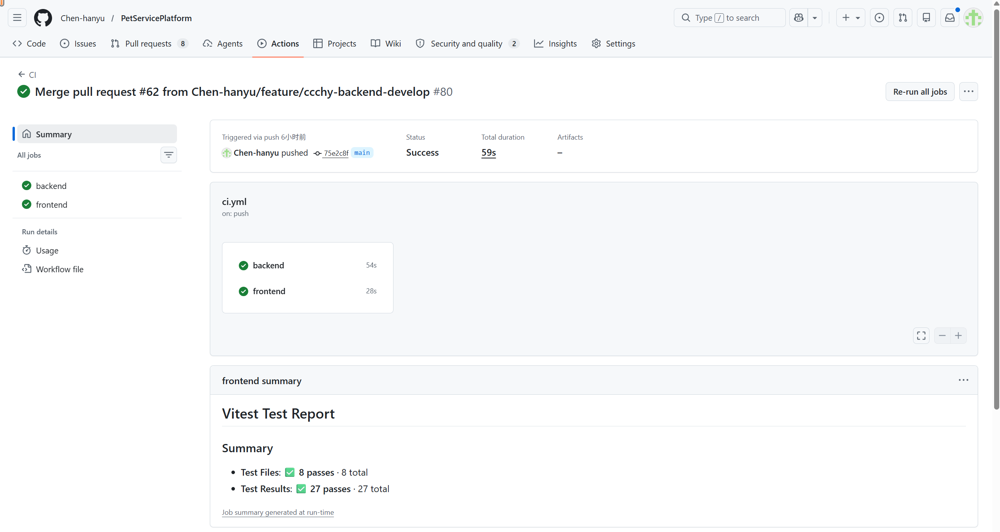

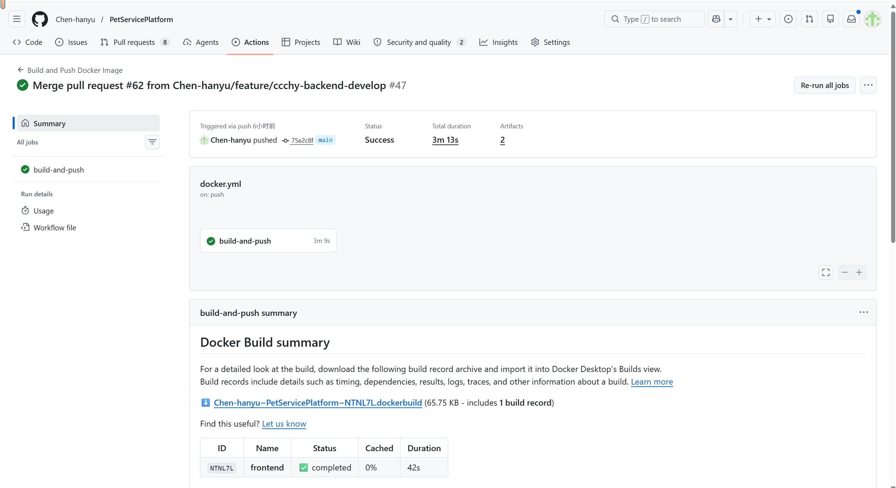


这几张截图分别对应代码检查、镜像构建和覆盖率反馈。它们的作用不是替代测试说明，而是证明最终提交前项目已经接入自动化质量门禁。

## 11.3 分支保护与质量门禁 [负责人：qutianshun、chenhanyu]

项目通过 PR 检查和自动化 workflow 控制质量。合并前应保证：

- 后端测试通过。
- 前端 lint 和测试通过。
- 覆盖率上传成功。
- 安全扫描没有阻塞级问题。
- Docker 构建能够完成。

本章由 AI 辅助整理，经团队按 `.github/workflows` 审核修改。

# 十二、系统部署 [负责人：qutianshun、chenhanyu]

## 12.1 部署架构 [负责人：qutianshun、chenhanyu]

系统采用前后端分离部署：

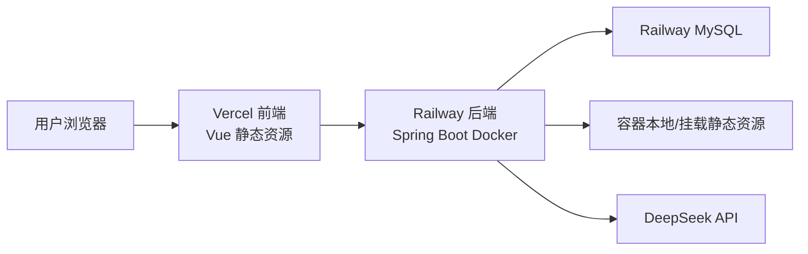

当前前端部署域名为 `https://pet-service-platform-7shx.vercel.app/`。后端部署在 Railway，健康检查路径为 `/health`。

## 12.2 容器化 [负责人：qutianshun、chenhanyu]

项目包含：

- `frontend/Dockerfile`
- `backend/Dockerfile`
- `docker-compose.yml`
- `compose.yaml`
- `compose.prod.yaml`
- `railway.toml`

后端 Railway 构建上下文为 `backend`，避免 Docker 构建时报 `"/src": not found`。前端 Docker 使用 Nginx 托管构建产物。

## 12.3 部署步骤 [负责人：qutianshun、chenhanyu]

本地 Docker：

```bash
docker compose -f docker-compose.yml up -d --build
```

Railway 后端：

1. 关联 GitHub 仓库。
2. 使用 `backend/Dockerfile` 构建。
3. 配置 MySQL 连接、JWT、AI、CORS、SQL 初始化等环境变量。
4. 健康检查路径设置为 `/health`。

Vercel 前端：

1. 关联 GitHub 仓库。
2. Root Directory 设置为 `frontend`。
3. Build Command 使用 `npm run build`。
4. 配置 `VITE_API_BASE_URL` 指向 Railway 后端。

## 12.4 环境配置 [负责人：chenhanyu、qutianshun]

关键变量包括：

- `SPRING_DATASOURCE_URL`
- `SPRING_DATASOURCE_USERNAME`
- `SPRING_DATASOURCE_PASSWORD`
- `SPRING_SQL_INIT_MODE`
- `JWT_SECRET`
- `VERIFY_CODE_ALLOW_DEFAULT_CODE`
- `APP_CORS_ALLOWED_ORIGIN_PATTERNS`
- `DEEPSEEK_API_KEY`
- `VITE_API_BASE_URL`

生产建议：

- `VERIFY_CODE_ALLOW_DEFAULT_CODE=false`
- `SPRING_SQL_INIT_MODE=never`（初始化完成后）
- `APP_CORS_ALLOWED_ORIGIN_PATTERNS=https://pet-service-platform-7shx.vercel.app`

本章由 AI 辅助整理，经团队按 `docs/deployment.md` 和部署配置审核修改。

# 十三、云服务应用 [负责人：qutianshun、chenhanyu]

## 13.1 云平台选型 [负责人：qutianshun、chenhanyu]

| 平台 | 用途 | 选择理由 |
|---|---|---|
| Vercel | 前端静态站点托管 | 与 GitHub 集成好，适合 Vite 项目自动部署 |
| Railway | 后端容器和 MySQL | 支持 Docker 部署、环境变量和健康检查，适合课程项目快速上线 |
| GitHub Actions | CI/CD | 与代码仓库天然集成 |

## 13.2 使用的云服务 [负责人：qutianshun、chenhanyu]

| 服务类型 | 产品 | 用途 |
|---|---|---|
| 静态站点托管 | Vercel | 托管 Vue 构建产物 |
| 容器运行 | Railway | 运行 Spring Boot 后端 |
| 数据库 | Railway MySQL | 存储业务数据 |
| CI/CD | GitHub Actions | 测试、覆盖率、镜像构建、安全扫描 |
| AI API | DeepSeek | AI 宠医助手回答生成 |

## 13.3 成本与资源配置 [负责人：qutianshun、chenhanyu]

项目使用课程演示可接受的免费或低成本方案。Vercel 和 Railway 的具体配额会随平台政策变化，因此文档不写固定额度作为承诺。当前系统数据量和访问量较小，资源配置足以支撑课程验收和演示。

本章由 AI 辅助整理，经团队按实际部署方案审核修改。

# 十四、可观测性与监控 [负责人：chenhanyu、qutianshun]

## 14.1 错误追踪 [负责人：chenhanyu、qutianshun]

当前未接入 Sentry 等第三方错误追踪平台。错误追踪主要通过前端 Axios 拦截器、后端结构化日志和后台监控面板实现。前端请求失败会输出结构化日志并给用户显示错误提示；后端异常由全局异常处理器统一返回。

## 14.2 日志管理 [负责人：chenhanyu、qutianshun]

后端使用 Logback 和 Logstash Logback Encoder 输出结构化日志，记录接口路径、状态码、耗时和异常信息。前端使用 `apiLogger` 记录请求耗时、状态码、失败次数等信息，便于在浏览器控制台和监控页面定位问题。

## 14.3 健康检查与可用性监控 [负责人：chenhanyu]

后端提供 `/health`，Railway 使用该路径判断服务是否健康。健康检查会验证应用状态和数据库连接。前端 `/health` 页面调用后端健康检查端点，并展示连接结果。

## 14.4 指标监控 [负责人：chenhanyu、qutianshun]

后端 `MetricsCollector` 收集以下指标：

- 总请求数。
- 成功请求数。
- 失败请求数。
- 错误率。
- 平均响应时间。
- 各路径请求统计。

后台 `/admin/monitoring` 页面通过 `/api/v1/admin/monitoring/metrics`、`/api/v1/admin/monitoring/metrics/paths` 展示数据，并提供重置指标操作。

本章由 AI 辅助整理，经团队按 `docs/monitoring.md` 和代码审核修改。

# 十五、性能优化 [负责人：qutianshun、chenhanyu]

## 15.1 性能基线报告 [负责人：qutianshun、chenhanyu]

项目已补充前端 Lighthouse 和后端接口性能截图，作为课程验收阶段的性能基线。由于测试环境、机器配置和网络条件会影响结果，报告不把截图中的数据夸大为生产级承诺，只将其作为当前版本优化效果和后续改进方向的依据。


从结果和实现方式看，当前阶段的优化重点是“避免明显低效”：列表分页、图片资源本地化、API 层复用、数据库索引、批量加载关联数据。项目尚未引入 Redis 缓存、CDN 图片处理或异步消息队列，这些属于未来访问量增加后的扩展方向。

## 15.2 已完成的优化项 [负责人：qutianshun、chenhanyu]

| 优化项 | 说明 | 负责人 |
|---|---|---|
| 前端 API 统一封装 | 减少页面重复错误处理和 URL 拼接 | qutianshun |
| 通用组件复用 | `DataState`、`StatusBadge` 等降低重复代码 | qutianshun |
| 图片资源本地化 | 避免正式页面依赖不稳定外链或占位图 | qutianshun |
| 分页查询 | 列表接口统一分页，避免一次加载过多数据 | chenhanyu |
| 索引设计 | 高频查询按用户、状态、时间建立索引 | chenhanyu |
| 批量加载关联数据 | 减少循环查询造成的性能问题 | chenhanyu |
| 监控指标 | 记录请求次数、错误率和响应耗时，便于发现问题 | chenhanyu |

本章由 AI 辅助整理，经团队按现有实现审核修改。

# 十六、功能展示 [负责人：qutianshun、chenhanyu]

## 16.1 系统演示 [负责人：qutianshun、chenhanyu]

以下截图均来自本地运行环境，前台使用普通用户 `13800000001 / 123456`，后台使用管理员账号登录。截图保存于 `docs/design/screenshots/`，用于说明最终系统已经从静态页面推进到真实接口联调后的运行状态。

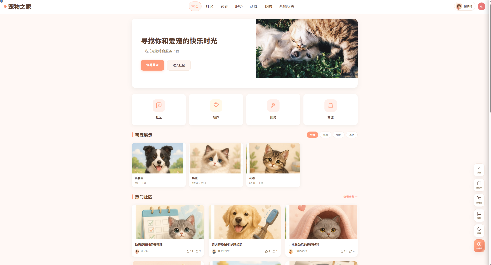

首页承担资源聚合入口，展示社区、领养、服务和商城等模块的推荐内容。该页面的价值在于帮助用户快速进入核心业务，而不是只作为装饰性欢迎页。

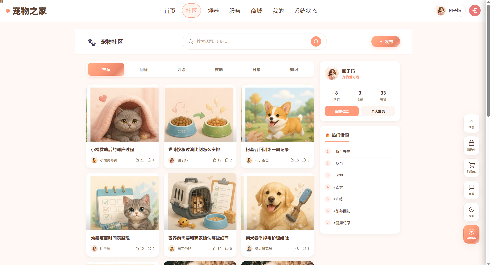

社区页面展示分类、搜索、热门话题和帖子列表。分类与搜索已经接入后端查询逻辑，用户可以围绕养宠经验、护理记录和救助信息进行内容浏览。

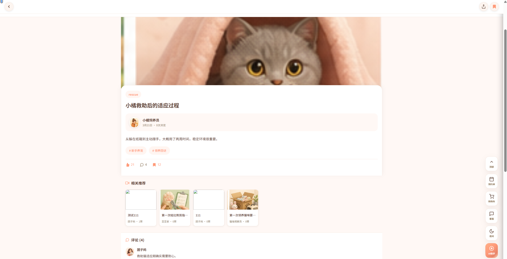

帖子详情页展示点赞、收藏和评论入口。该页面验证了社区互动链路：用户在详情页产生互动后，后端记录状态，前端重新读取并更新显示。

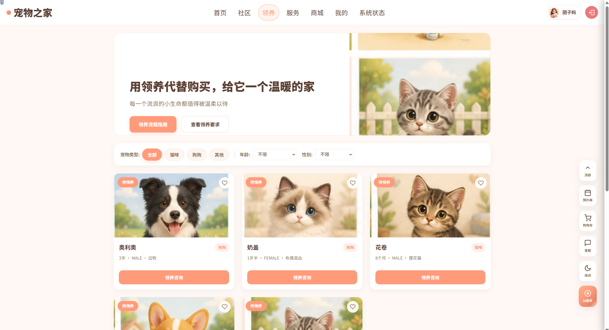

领养页面包含宠物类型筛选、领养流程说明和申请入口。领养申请提交后会进入后台审核列表，用户也可以在个人中心查看自己的申请记录。

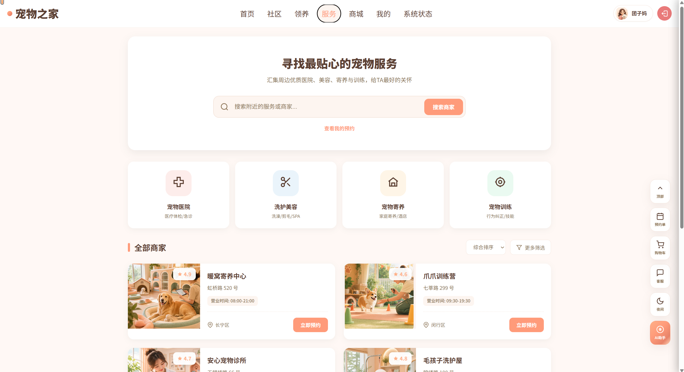

服务页面展示服务分类和商家列表。用户可以进入商家详情并提交预约，预约记录会同步到个人中心和后台服务管理。

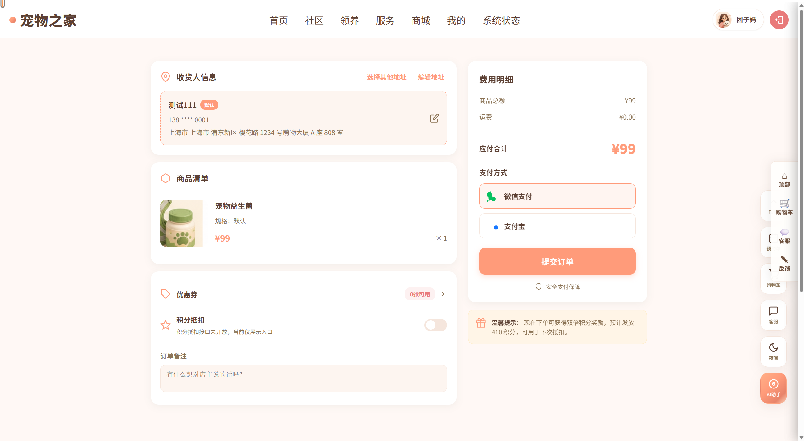

商城结算页展示收货地址、商品数量、优惠券和订单提交。支付后订单状态进入后端状态机，后台可以继续执行发货，用户端可查看订单进度。

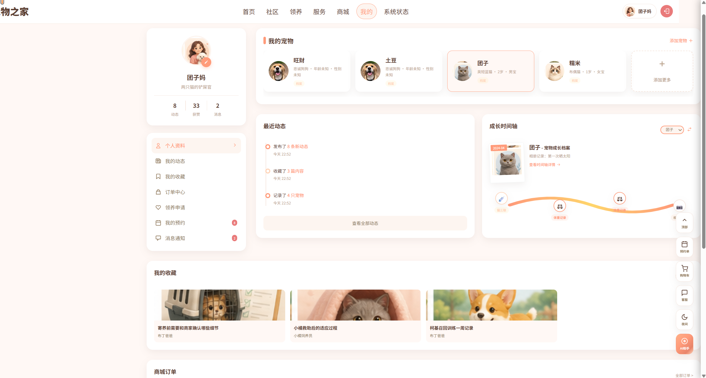

个人中心集中展示宠物档案、最近动态、收藏、订单、预约、领养申请和消息通知。该页面是验证跨模块数据归属的重要入口，所有内容都应来自当前登录用户。

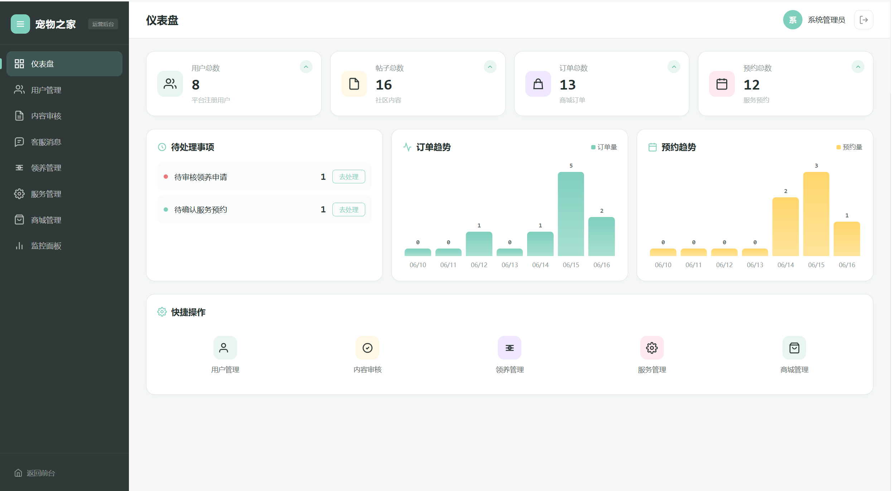

后台仪表盘展示统计卡片和待处理事项。管理员可以从这里快速进入订单、预约、领养审核和客服处理等运营任务。

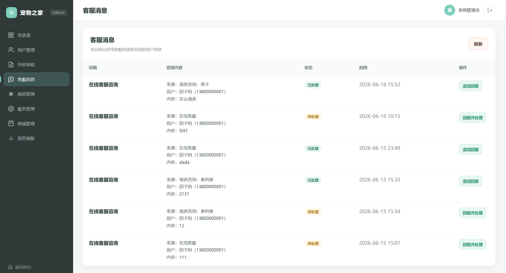

客服消息页面展示用户咨询和管理员回复入口。管理员回复后，用户端消息中心和侧边栏在线客服会话能看到对应内容。

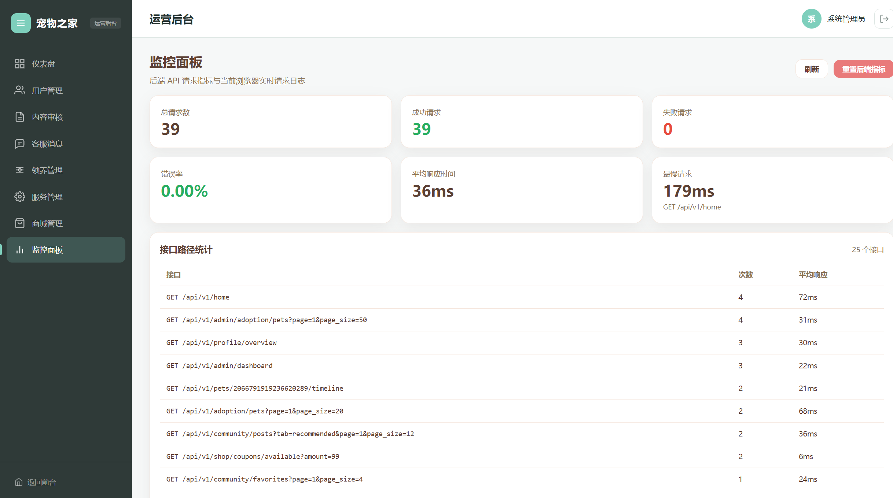

监控面板展示请求数量、成功率、失败率、平均响应时间和路径统计。该页面用于课程项目中的基础可观测性演示，帮助定位接口是否正常被调用。

## 16.2 性能测试结果 [负责人：qutianshun、chenhanyu]

性能测试截图已在第十五章展示。前端截图来自 Lighthouse，后端截图来自接口性能测试工具。两类截图共同说明当前系统在课程验收规模下可以完成基本访问、接口响应和页面渲染。

需要说明的是，本项目没有把这些截图包装成生产级 SLA，也没有承诺固定并发数下的长期稳定性。对于课程项目而言，它们的作用是证明团队已经关注性能问题，并能用工具给出可复查的测试证据。

本章由 AI 辅助整理，经团队审核修改。

# 十七、总结与展望 [负责人：qutianshun、chenhanyu]

## 17.1 项目总结 [负责人：qutianshun、chenhanyu]

本项目完成了宠物综合服务平台的主要功能闭环。用户端可以完成社区互动、领养申请、服务预约、商城下单、宠物档案管理和消息查看；管理端可以完成审核、运营配置、订单/预约处理、客服回复和监控查看；后端提供统一 REST API、JWT 权限、数据库持久化、文件上传、AI 接入和健康检查。

## 17.2 技术收获 [负责人：qutianshun、chenhanyu]

qutianshun 的主要收获：

- 掌握 Vue 3 + TypeScript 在多模块业务系统中的组织方式。
- 实践前端 API 层封装、状态管理、后台表格页和用户端体验设计。
- 通过联调修复理解了“页面状态必须来自真实后端”的重要性。

chenhanyu 的主要收获：

- 掌握 Spring Boot 3、Spring Security、JWT、MyBatis-Plus 的组合实践。
- 完成较完整的数据库建模、状态流转、权限归属校验和部署排障。
- 熟悉 CI、覆盖率、安全扫描、Docker 和 Railway 部署流程。

## 17.3 问题与反思 [负责人：qutianshun、chenhanyu]

项目中暴露出几个问题：

1. 早期文档更新不及时，导致前端、后端和数据库说明与代码不一致。后期通过集中整理 `docs/api.md`、`docs/database.md`、`docs/integration.md` 进行了修正。
2. 部署环境与本地环境差异明显，例如 CORS、SQL 初始化、种子数据编码、生产已有表结构等，需要更早在测试环境验证。
3. 一些功能最初只完成页面展示，后续才补齐真实接口对接。这个问题说明联调清单应更早建立。
4. 性能测试没有形成正式报告，后续应补充 Lighthouse 和后端压测结果，而不是只做代码层面的优化说明。

## 17.4 未来展望 [负责人：qutianshun、chenhanyu]

后续可扩展方向：

- 接入对象存储，替代容器本地图片存储。
- 接入 WebSocket，实现客服和消息实时推送。
- 增加更完整的 E2E 自动化测试。
- 为 AI 助手增加图片问诊、知识库检索和风险分级提示。
- 增加正式性能监控和告警平台。

本章由 AI 辅助整理，经团队审核修改。

# 参考文献

[1] Vue 官方文档. https://vuejs.org/
[2] Vite 官方文档. https://vite.dev/
[3] TypeScript 官方文档. https://www.typescriptlang.org/
[4] Pinia 官方文档. https://pinia.vuejs.org/
[5] Vue Router 官方文档. https://router.vuejs.org/
[6] Axios 官方文档. https://axios-http.com/
[7] Spring Boot 官方文档. https://spring.io/projects/spring-boot
[8] Spring Security 官方文档. https://spring.io/projects/spring-security
[9] MyBatis-Plus 官方文档. https://baomidou.com/
[10] MySQL 官方文档. https://www.mysql.com/
[11] Docker 官方文档. https://docs.docker.com/
[12] GitHub Actions 官方文档. https://docs.github.com/en/actions
[13] Vercel 官方文档. https://vercel.com/docs
[14] Railway 官方文档. https://docs.railway.com/
[15] DeepSeek API 文档. https://platform.deepseek.com/
[16] OWASP Top 10. https://owasp.org/www-project-top-ten/

# AI 使用声明

本文档中以下部分由 AI 辅助整理，经 qutianshun、chenhanyu 结合代码、文档和运行结果人工审核修改：

| 章节 | AI 使用方式 | 人工审核内容 |
|---|---|---|
| 全文结构 | 按老师模板重排并补齐负责人 | 对照 `docs/文档.md` 保留章节结构 |
| 项目介绍、架构、API、前后端实现 | 生成说明性初稿 | 对照实际代码和 README 修改 |
| 安全、测试、CI/CD、部署、监控 | 汇总已有文档 | 对照 `.github/workflows`、配置文件和测试报告修改 |
| 总结与展望 | 辅助归纳 | 删除未实现功能描述，保留真实不足 |

AI 只用于辅助表达和整理，项目实现、最终判断和内容取舍由团队成员完成。

# 第三方库与开源引用

| 库 / 框架 | 版本 | 用途 | 来源 |
|---|---|---|---|
| Vue | 3.5.13 | 前端框架 | https://vuejs.org/ |
| Vite | 6.2.0 | 构建工具 | https://vite.dev/ |
| TypeScript | 5.8.2 | 类型系统 | https://www.typescriptlang.org/ |
| Vue Router | 4.5.0 | 前端路由 | https://router.vuejs.org/ |
| Pinia | 2.3.1 | 状态管理 | https://pinia.vuejs.org/ |
| Axios | 1.9.0 | HTTP 请求 | https://axios-http.com/ |
| Sass | 1.85.1 | SCSS 编译 | https://sass-lang.com/ |
| Vitest | 4.1.5 | 前端测试 | https://vitest.dev/ |
| Vue Testing Library | 8.1.0 | Vue 组件测试 | https://testing-library.com/docs/vue-testing-library/intro/ |
| Spring Boot | 3.5.11 | 后端框架 | https://spring.io/projects/spring-boot |
| Spring Security | 随 Spring Boot | 权限认证 | https://spring.io/projects/spring-security |
| MyBatis-Plus | 3.5.15 | ORM | https://baomidou.com/ |
| JJWT | 0.12.7 | JWT 生成和解析 | https://github.com/jwtk/jjwt |
| Springdoc OpenAPI | 2.8.16 | Swagger/OpenAPI | https://springdoc.org/ |
| Logstash Logback Encoder | 8.0 | JSON 结构化日志 | https://github.com/logfellow/logstash-logback-encoder |
| JaCoCo | 0.8.14 | 后端覆盖率 | https://www.jacoco.org/jacoco/ |
| H2 Database | 测试依赖 | 后端集成测试 | https://www.h2database.com/ |

以上第三方库均通过 npm 或 Maven 正常引入，项目未直接复制第三方源码。

# 项目结构

```text
PetServicePlatform/
├── README.md
├── CODEX.md
├── docker-compose.yml
├── compose.yaml
├── compose.prod.yaml
├── railway.toml
├── vercel.json
├── .github/workflows/
│   ├── ci.yml
│   ├── backend-test.yml
│   ├── frontend-test.yml
│   ├── security.yml
│   ├── codeql.yml
│   └── docker.yml
├── docs/
│   ├── project-report.md
│   ├── 文档.md
│   ├── api.md
│   ├── api.yaml
│   ├── architecture.md
│   ├── database.md
│   ├── frontend.md
│   ├── backend.md
│   ├── deployment.md
│   ├── monitoring.md
│   ├── security-review.md
│   ├── ai-feature.md
│   ├── integration.md
│   ├── design/
│   └── contributions/
├── frontend/
│   ├── Dockerfile
│   ├── nginx.conf
│   ├── package.json
│   ├── vite.config.ts
│   └── src/
│       ├── api/
│       ├── components/
│       ├── layout/
│       ├── pages/
│       ├── router/
│       ├── store/
│       ├── styles/
│       ├── types/
│       ├── utils/
│       └── __tests__/
└── backend/
    ├── Dockerfile
    ├── pom.xml
    ├── mvnw / mvnw.cmd
    └── src/
        ├── main/java/com/petplatform/
        │   ├── admin/controller/
        │   ├── common/
        │   ├── config/
        │   ├── controller/
        │   ├── dto/
        │   ├── entity/
        │   ├── mapper/
        │   ├── security/
        │   └── service/
        ├── main/resources/
        │   ├── application.yml
        │   ├── mapper/
        │   └── sql/
        └── test/java/com/petplatform/
```
